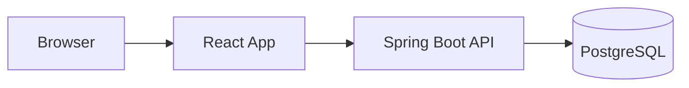
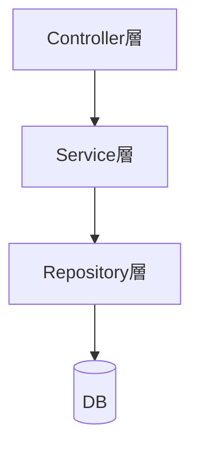

# アーキテクチャ

## 技術スタック

| 層 | 技術 |
|----|------|
| Frontend | React + TypeScript |
| Backend | Java Spring Boot |
| DB | PostgreSQL |
| API | REST / JSON |

## システム構成

```mermaid
flowchart LR
  Browser[Browser] --> React[React App]
  React --> API[Spring Boot API]
  API --> DB[(PostgreSQL)]
```

## バックエンド層構成

```mermaid
flowchart TD
  Controller[Controller層] --> Service[Service層]
  Service --> Repository[Repository層]
  Repository --> DB[(DB)]
```
