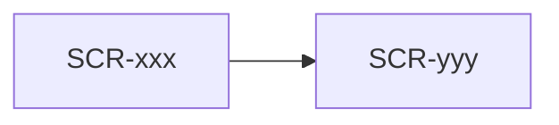

# 画面設計: <機能名>

## ユースケースと画面の対応

| UC-ID | 必要な画面 |
|-------|------------|

## 画面一覧

| SCR-ID | 名前 | ルート | 主な操作 | 呼ぶAPI |
|--------|------|--------|----------|---------|

## 画面遷移



## 対応マトリクス

| SCR-ID | 画面 | 関連REQ | 呼ぶAPI | 主コンポーネント | 遷移先 |
|--------|------|---------|---------|------------------|--------|

---

## SCR-xxx: [画面名]

### 目的

[1〜2文]

### レイアウト

| エリア | 要素 | 動作 |
|--------|------|------|

### ワイヤー（ASCII）

```
┌─────────────────┐
│                 │
└─────────────────┘
```

### 状態

| 状態 | 見た目・振る舞い |
|------|------------------|
| 初期 | |
| 送信中 | |
| エラー | |

### 操作と結果

| 操作 | 条件 | 結果 |
|------|------|------|
