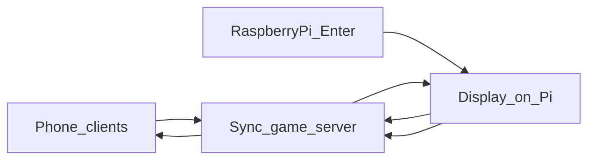
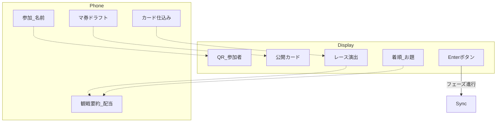

# アーキテクチャ

## 技術スタック

| 層 | 技術 | 状態 |
|----|------|------|
| Display（会場画面） | Pygame 想定（[`assets/`](../../../../assets/) が Pygame 向け）。Raspberry Pi 上で動作する想定 | 草案 |
| Phone（操作UI） | 未確定（Web クライアント想定） | 未確定 |
| 同期・ゲーム状態 | 未確定 | 未確定 |
| 永続化 | 未確定（対局中はメモリでも可） | 未確定 |
| 入力 | ラズパイに接続した **Enter ボタン**（フェーズ進行） | 草案 |

テンプレの React / Spring Boot / PostgreSQL をそのままゲーム本体に適用しない。確定は別設計で行う。

## システム構成

| 要素 | 責務 |
|------|------|
| Phone | 参加、マ券ドラフト、セーフ／リスキー、カード仕込み、観戦・配当の個人表示 |
| Display（Pi） | QR、公開カード、レース演出、着順。Enter 入力の受付 |
| Sync | ルール進行、在庫・手番、全員揃い判定、全端末への状態配信 |
| ラズパイ Enter | フェーズ進行（全員揃いに並ぶ主トリガー）。時間遷移は使わない |

## クライアント分担（概念）

## バックエンド層構成

未確定。確定時に Controller / Service / 状態マシン等を `features/` 設計で定義する。
