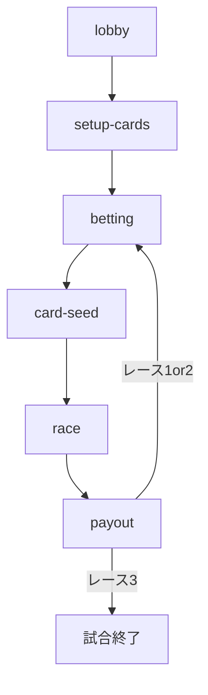

# 機能マップ

タスク分解（Epic / Sub・ラベル）: [task-breakdown.md](./task-breakdown.md)

## 機能一覧

| 機能ID | 名前 | ステータス | 概要 |
|--------|------|------------|------|
| lobby | 参加・ロビー | draft | QR参加、参加者同期、初期$10。進行は全員揃いまたはラズパイ Enter |
| setup-cards | 公開カード準備 | draft | スターター＋人数分の表向き公開、レーン表示 |
| betting | マ券・サイドベット | draft | スネークドラフト、セーフ／リスキー、第3レースの1枚ダブル |
| card-seed | カード仕込み | draft | 手札1枚をデッキへ、開始時デッキ組成（標準18枚） |
| race | レース進行 | draft | バーン、めくり、カード効果、DQ、コース短縮 |
| payout | 配当 | draft | 精算とレース間リセット（札戻し・お題更新・手札補充・先頭ローテ） |

※ `manifest.yaml` の `features` は、各機能の `features/<id>/` を起こす設計PRで同期する。現時点: `lobby`, `setup-cards`, `betting` を掲載。

## 機能間の関係

1レースの塊: `betting → card-seed → race → payout` を最大3回。

## 実装順序（案）

| 順序 | 機能ID | 理由 |
|------|--------|------|
| 1 | lobby | 参加とセッションが他機能の前提 |
| 2 | setup-cards | 公開情報がないとベット判断ができない |
| 3 | betting | 原作フロー上、仕込みより先 |
| 4 | card-seed | デッキ組成の直前工程 |
| 5 | race | 観戦・演出の中核 |
| 6 | payout | 精算と次レースへの橋渡し |
