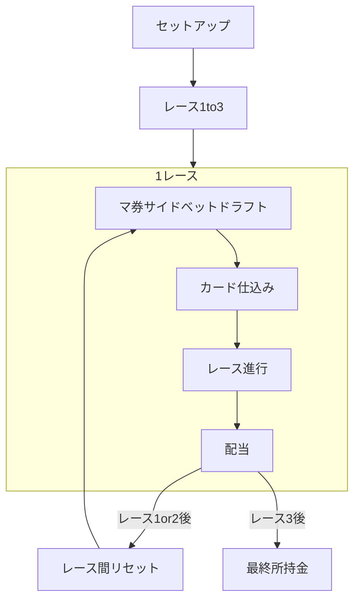

# HotStreak（ホットストリーク）

## 目的

卓上ボードゲーム『ホットストリーク 熱狂・絶叫・徒競走』（原作: CMYK / Hot Streak）を、会場の**ディスプレイ**と各プレイヤーの**スマホ**で遊べるデジタル体験として再現する。マスコットのハチャメチャなレースを観戦しながら、マ券・サイドベットとカード仕込みで賭けを楽しむ。

## スコープ

| 含む | 含まない |
|------|----------|
| 標準人数（目安 3〜8人）の正規ルール流れ | 2人用バリアント |
| スマホ操作＋ディスプレイ観戦の二画面 | 9人以上用（紙投票・ポット）バリアント |
| QR参加・参加者同期・ラズパイ Enter による進行 | ルール全文の転載・公式コンポーネントの複製配布 |
| 3レース・スネークドラフト・仕込み・バーン・DQ・コース短縮・配当 | **時間経過による画面遷移**（20秒／15秒など） |
| | 技術スタックの最終確定（別途） |

## ルール・流れの正本

- 英語ルールブック（CMYK）を構造の正とする
- 日本語の用語は公式コピー（勝ちマスコット投票券＝**マ券** など）に合わせる
- [`docs/design/wireframes/`](../../wireframes/) はラフ。表記・順序が食い違う場合は本設計（原作）を優先する

## 正規ゲームフロー

### セットアップ

| 項目 | ルール |
|------|--------|
| 初期所持金 | 各プレイヤー **$10** |
| 初期手札 | 各 **3枚**（裏向き）。余りは未使用 |
| 公開カード | スターター4枚（マスコット各1）＋人数に応じたランダム枚を表向き公開（3人:11 … 8人:6） |
| マ券 | 色ごとに6山。セーフ面を上 |
| サイドベット | お題カードを1枚表向き。YES/NO 用チケットと併用 |
| ドラフト先頭 | 最初は任意（例: 一番運の悪い人）。以降レースごとに時計回りローテ |
| デジタル追加 | QR参加・全端末への参加者同期。進行は下表のトリガー |

### 進行トリガー（デジタル）

時間カウントによるフェーズ遷移は**しない**。次へ進む条件は次のいずれか。

| トリガー | 説明 |
|----------|------|
| 全員揃い | そのフェーズで必要な操作を全員が完了した（例: 全員名前確定、全員マ券2枚、全員仕込み済） |
| ラズパイ Enter | Display 側（Raspberry Pi）に接続した **Enter ボタン**押下。司会が進行する |

例外: レース**進行中**のカードめくり・着順確定はルール演算の結果であり、タイマー遷移ではない。配当画面から次レース／ロビーへは、全員確認不要でも **Enter**（または明示の全員揃い条件を機能設計で定義）で進める。

未完了のまま Enter した場合の未選択確定ルールは、各機能の詳細設計で定義する。

### 1レースの順序

1. **ベット（スネークドラフト）** — 各2枚。取得直後にセーフ／リスキー。1周目時計回り、2周目逆順
2. **カード仕込み** — 手札1枚を裏でレーシングデッキへ。開始時デッキは標準で **18枚**
3. **レース進行** — 3枚バーン（「3, 2, 1…GO!」）後にめくり。山切れでリシャッフル＋コース短縮。3体がゴールまたは失格で終了
4. **配当** — マスコットベットは着順に応じ札面（4着 $0）。サイドベットは YES/NO。リスキー外れは損失あり（最低所持 $0）

### レース間（1→2、2→3）

マ券返却、サイドベットお題の更新、既存デッキから各1枚補充（手札を再び3枚）、コース／マスコットのリセット、ドラフト先頭のローテ。

### 第3レース

2枚目取得後、**自分の2枚のうち1枚だけ**配当ダブル（マイナスも倍）。全体×2ではない。

### 勝利条件

3レース終了後、所持金が最多のプレイヤーが勝ち。

## 用語集

| 用語 | 説明 |
|------|------|
| ホットストリーク / Hot Streak | 原作ボードゲーム。副題「熱狂・絶叫・徒競走」。本リポジトリはそのデジタル再現 |
| マスコット | レースする4体の着ぐるみ駒（英名例: Gobbler / Hurley / Dangle / Mum）。プレイヤー本人ではない |
| プレイヤー | 賭ける人間。所持金を競う |
| レース | 試合の単位。全3レース。各レースはベット → 仕込み → 進行 → 配当 |
| マ券 | 勝ちマスコット投票券の略。順位に応じて配当 |
| サイドベット | コースアウト・気絶など奇妙な展開への賭け |
| セーフ / リスキー | マ券・サイドベットの表裏（英: Safe / Risky） |
| スネークドラフト | 時計回り→逆順で各2枚取る方式 |
| 手札 | 各プレイヤーのレースカード（初期3枚） |
| カード仕込み | レース前に手札1枚をレーシングデッキへ入れること |
| 公開カード | 人数に応じて事前に表向き出すレースカード群 |
| レーシングデッキ | 公開カード＋仕込みで組む山。開始時は所定枚数 |
| バーン | スタート時に山の上から3枚を捨てる演出・手順 |
| 今回のカード | めくられた1枚。対象マスコットと効果 |
| 転倒 / 方向転換 / スワーブ / 復帰 / 衝突 / 緑マルチ | レースカード効果の種別 |
| 失格（DQ） | ノックアウトまたはアウトオブバウンズなど |
| コース短縮 | 山切れ時にトラックを折りたたみ短縮。デジタルワイヤーの「コース崩壊」に相当 |
| 配当 | レース後の精算 |
| ブックメーカー / ディーラー / ハンドラー | 卓上の役。デジタルでは Display・サーバーが代替しうる |
| ディスプレイ | 会場共有のメイン画面 |
| スマホ | 各プレイヤーの操作端末 |
| ラズパイ Enter | Display（Raspberry Pi）の Enter ボタン。フェーズ進行の主トリガー |
| 全員揃い | 当該フェーズの必要操作を全員が終えた状態。これでも次フェーズへ進める |

使わない旧ワイヤー表記: 「馬券」「ノーマル」「イベント」（曖昧）、「払戻すべて×2」。

## ワイヤーとの差分

| ワイヤー | 設計上の扱い |
|----------|--------------|
| HTML: 提出→馬券→レース | **マ券ドラフト→仕込み→レース→配当** に合わせる。HTMLは旧順注記付きで残置 |
| HTML: 馬券／ノーマル／全体×2 | マ券／セーフ／1枚ダブル |
| HTML: 提出20秒・結果15秒など時間遷移 | **不採用**。全員揃いまたはラズパイ Enter |
| 開始前PNG | 参加・公開カード・マ券・仕込みのイメージ源。順序は本 overview の正規フロー |
| 進行PNGのコース崩壊 | コース短縮（リシャッフル）として解釈 |
| QR・ラズパイ Enter | デジタル固有として残す |

ラフの索引と画面設計MD: [`docs/design/wireframes/README.md`](../../wireframes/README.md)（[phone/screens.md](../../wireframes/phone/screens.md) / [display/screens.md](../../wireframes/display/screens.md)）

説明書（HTML草案）: [`manual.html`](../manual.html)（ブラウザで開く）
