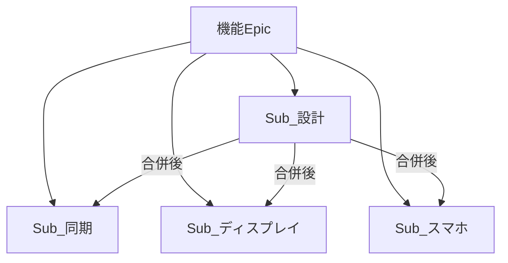

# タスク分解

機能単位の Epic 配下に、設計 / ディスプレイ / スマホ / 同期を **別 Issue** として並べる。  
ディスプレイとスマホは 1 Issue に混ぜない。

正本の機能一覧・実装順: [feature-map.md](./feature-map.md)  
画面ラフ: [phone/screens.md](../../wireframes/phone/screens.md) / [display/screens.md](../../wireframes/display/screens.md)

## ラベル

Issue 化時に作成する（すべて日本語）。

| 分類 | ラベル名 |
|------|----------|
| 種別 | `設計` |
| 種別 | `実装` |
| 側 | `ディスプレイ` |
| 側 | `スマホ` |
| 側 | `同期` |
| 機能 | `機能/lobby` |
| 機能 | `機能/setup-cards` |
| 機能 | `機能/betting` |
| 機能 | `機能/card-seed` |
| 機能 | `機能/race` |
| 機能 | `機能/payout` |

付与の目安:

| Sub の種類 | 種別 | 側 | 機能 |
|------------|------|----|------|
| 設計 | `設計` | （なし） | `機能/<id>` |
| 同期 | `実装` | `同期` | `機能/<id>` |
| ディスプレイ | `実装` | `ディスプレイ` | `機能/<id>` |
| スマホ | `実装` | `スマホ` | `機能/<id>` |
| Epic | （なし） | （なし） | `機能/<id>` |

## タイトル規約

```
[<feature-id>][設計|ディスプレイ|スマホ|同期] <短い名前>
```

Epic は次の形式:

```
[Epic][<feature-id>] <機能の日本語名>
```

例:

- `[Epic][lobby] 参加・ロビー`
- `[lobby][設計] 参加・ロビーの設計`
- `[lobby][同期] 参加同期・初期所持金`
- `[lobby][ディスプレイ] 参加受付`
- `[lobby][スマホ] ロビー（参加）`

## 着手条件

| 種類 | 着手できるとき |
|------|----------------|
| 設計 | いつでも（ブランチ `design/<feature-id>`） |
| 同期 / ディスプレイ / スマホ | 当該機能の設計 Sub 完了、かつ設計PRが `develop` に合併済み |

実装中の `docs/design/` はリードオンリー（開発フロー準拠）。

## 分解表

| 順序 | Epic | Sub | タイトル案 | 主な根拠画面 / 範囲 |
|------|------|-----|------------|---------------------|
| 1 | lobby | 設計 | `[lobby][設計] 参加・ロビーの設計` | `features/lobby/` |
| | | 同期 | `[lobby][同期] 参加同期・初期所持金` | QR参加・参加者同期・初期$10・全員揃い/Enter |
| | | ディスプレイ | `[lobby][ディスプレイ] 参加受付` | SCR-display-001 |
| | | スマホ | `[lobby][スマホ] ロビー（参加）` | SCR-phone-001 |
| 2 | setup-cards | 設計 | `[setup-cards][設計] 公開カード準備の設計` | `features/setup-cards/` |
| | | 同期 | `[setup-cards][同期] 公開カード・レーン状態` | スターター＋人数分公開・レーン状態 |
| | | ディスプレイ | `[setup-cards][ディスプレイ] 公開カード` | SCR-display-002 |
| | | （スマホなし） | — | 専用スマホ画面なし |
| 3 | betting | 設計 | `[betting][設計] マ券・サイドベットの設計` | `features/betting/` |
| | | 同期 | `[betting][同期] スネークドラフト・セーフ/リスキー` | スネークドラフト・セーフ/リスキー・第3の1枚ダブル |
| | | ディスプレイ | `[betting][ディスプレイ] マ券ドラフト共有` | SCR-display-003 |
| | | スマホ | `[betting][スマホ] マ券ドラフト` | SCR-phone-002 |
| 4 | card-seed | 設計 | `[card-seed][設計] カード仕込みの設計` | `features/card-seed/` |
| | | 同期 | `[card-seed][同期] 仕込み・デッキ組成` | 手札1枚仕込み・デッキ組成（標準18） |
| | | ディスプレイ | `[card-seed][ディスプレイ] 仕込み〜準備完了` | SCR-display-004 |
| | | スマホ | `[card-seed][スマホ] カード仕込み` | SCR-phone-003 |
| 5 | race | 設計 | `[race][設計] レース進行の設計` | `features/race/` |
| | | 同期 | `[race][同期] バーン・めくり・効果・DQ` | バーン・めくり・効果・DQ・コース短縮 |
| | | ディスプレイ | `[race][ディスプレイ] レース進行` | SCR-display-005 |
| | | スマホ | `[race][スマホ] レース観戦` | SCR-phone-004 / 004b |
| 6 | payout | 設計 | `[payout][設計] 配当の設計` | `features/payout/` |
| | | 同期 | `[payout][同期] 精算・レース間リセット` | 精算・レース間リセット・最終所持金 |
| | | ディスプレイ | `[payout][ディスプレイ] 着順・結果` | SCR-display-006 |
| | | スマホ | `[payout][スマホ] 配当` | SCR-phone-005 |

計: Epic 6 + Sub 22（スマホ無しが1つ）。



## Issue 本文テンプレ

### Epic

```markdown
## 概要
- 機能ID: <feature-id>
- 名前: <日本語名>
- 分解正本: `docs/design/hotstreak/00-project/task-breakdown.md`

## Sub-Issue
- （作成後にリンクを列挙）

## 実装順上の前提
- 先行機能: <あれば>
```

### 設計 Sub

```markdown
## 要件
- 機能: <feature-id>
- 種別: 設計

## 設計書
- 作成先: `docs/design/hotstreak/features/<feature-id>/`
- ブランチ: `design/<feature-id>`
- PR base: `develop`

## 受け入れ条件
- [ ] `features/<feature-id>/` の設計書一式が揃っている
- [ ] feature-map / manifest と同期している
- [ ] 設計PRが develop に合併されている
```

### 実装 Sub（同期 / ディスプレイ / スマホ）

```markdown
## 要件
- 機能: <feature-id>
- 側: <同期|ディスプレイ|スマホ>

## 設計書
- `docs/design/hotstreak/features/<feature-id>/`
- 画面: <SCR-ID または「画面なし・サーバのみ」>

## ワイヤー（参考）
- ディスプレイ: `docs/design/wireframes/display/screens.md`
- スマホ: `docs/design/wireframes/phone/screens.md`

## 着手条件
- [ ] 当該機能の設計 Sub が完了している
- [ ] 設計PRが `develop` に合併済みである

## 受け入れ条件
- [ ] 設計書の該当範囲を満たす
- [ ] ディスプレイとスマホを同一 Issue / 同一 PR に混ぜていない

## 実装ルール
- 設計書を正本とする（リードオンリー）
- ブランチ: `feat/<feature-id>-<短い識別子>`
- PR base: `develop`
```

## GitHub Project

- Board: [HotStreak（org projects/7）](https://github.com/orgs/nittohbs-dev/projects/7)
- Status: Epic / Sub とも **未着手**

## GitHub Issue URL

| 種類 | タイトル | URL |
|------|----------|-----|
| Epic | `[Epic][lobby] 参加・ロビー` | https://github.com/nittohbs-dev/HotStreak/issues/11 |
| 設計 | `[lobby][設計] 参加・ロビーの設計` | https://github.com/nittohbs-dev/HotStreak/issues/28 |
| 同期 | `[lobby][同期] 参加同期・初期所持金` | https://github.com/nittohbs-dev/HotStreak/issues/22 |
| ディスプレイ | `[lobby][ディスプレイ] 参加受付` | https://github.com/nittohbs-dev/HotStreak/issues/23 |
| スマホ | `[lobby][スマホ] ロビー（参加）` | https://github.com/nittohbs-dev/HotStreak/issues/24 |
| Epic | `[Epic][setup-cards] 公開カード準備` | https://github.com/nittohbs-dev/HotStreak/issues/12 |
| 設計 | `[setup-cards][設計] 公開カード準備の設計` | https://github.com/nittohbs-dev/HotStreak/issues/25 |
| 同期 | `[setup-cards][同期] 公開カード・レーン状態` | https://github.com/nittohbs-dev/HotStreak/issues/26 |
| ディスプレイ | `[setup-cards][ディスプレイ] 公開カード` | https://github.com/nittohbs-dev/HotStreak/issues/27 |
| Epic | `[Epic][betting] マ券・サイドベット` | https://github.com/nittohbs-dev/HotStreak/issues/13 |
| 設計 | `[betting][設計] マ券・サイドベットの設計` | https://github.com/nittohbs-dev/HotStreak/issues/29 |
| 同期 | `[betting][同期] スネークドラフト・セーフ/リスキー` | https://github.com/nittohbs-dev/HotStreak/issues/30 |
| ディスプレイ | `[betting][ディスプレイ] マ券ドラフト共有` | https://github.com/nittohbs-dev/HotStreak/issues/31 |
| スマホ | `[betting][スマホ] マ券ドラフト` | https://github.com/nittohbs-dev/HotStreak/issues/32 |
| Epic | `[Epic][card-seed] カード仕込み` | https://github.com/nittohbs-dev/HotStreak/issues/15 |
| 設計 | `[card-seed][設計] カード仕込みの設計` | https://github.com/nittohbs-dev/HotStreak/issues/33 |
| 同期 | `[card-seed][同期] 仕込み・デッキ組成` | https://github.com/nittohbs-dev/HotStreak/issues/34 |
| ディスプレイ | `[card-seed][ディスプレイ] 仕込み〜準備完了` | https://github.com/nittohbs-dev/HotStreak/issues/35 |
| スマホ | `[card-seed][スマホ] カード仕込み` | https://github.com/nittohbs-dev/HotStreak/issues/36 |
| Epic | `[Epic][race] レース進行` | https://github.com/nittohbs-dev/HotStreak/issues/14 |
| 設計 | `[race][設計] レース進行の設計` | https://github.com/nittohbs-dev/HotStreak/issues/43 |
| 同期 | `[race][同期] バーン・めくり・効果・DQ` | https://github.com/nittohbs-dev/HotStreak/issues/44 |
| ディスプレイ | `[race][ディスプレイ] レース進行` | https://github.com/nittohbs-dev/HotStreak/issues/37 |
| スマホ | `[race][スマホ] レース観戦` | https://github.com/nittohbs-dev/HotStreak/issues/38 |
| Epic | `[Epic][payout] 配当` | https://github.com/nittohbs-dev/HotStreak/issues/16 |
| 設計 | `[payout][設計] 配当の設計` | https://github.com/nittohbs-dev/HotStreak/issues/39 |
| 同期 | `[payout][同期] 精算・レース間リセット` | https://github.com/nittohbs-dev/HotStreak/issues/40 |
| ディスプレイ | `[payout][ディスプレイ] 着順・結果` | https://github.com/nittohbs-dev/HotStreak/issues/42 |
| スマホ | `[payout][スマホ] 配当` | https://github.com/nittohbs-dev/HotStreak/issues/41 |
