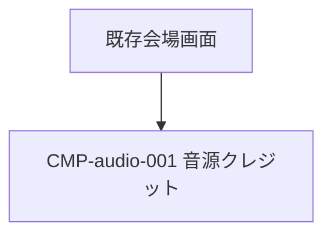

# UIコンポーネント: 会場BGM・効果音

## コンポーネントツリー

## コンポーネント一覧

| CMP-ID | 名前 | 役割 | 親 | 主な入出力 |
|--------|------|------|-----|------------|
| CMP-audio-001 | 音源クレジット | 作者・配布元・CC BY 4.0を表示 | 既存会場画面 | 入力なし / 固定文字列 |
