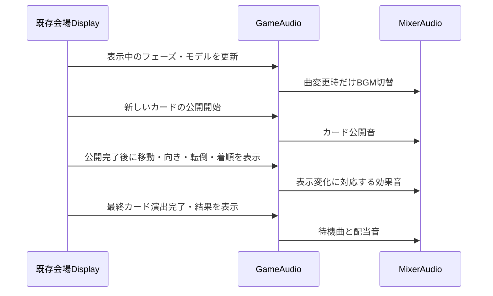

# フロー: 会場BGM・効果音

## シーケンス

## 状態遷移

| 状態 | イベント | 次の状態 |
|------|----------|----------|
| 未開始 | 初回状態 | 表示フェーズの曲、過去の単発音なし |
| 待機曲 | レース表示開始 | レース曲・既存開始カウントに対応する音 |
| レース曲 | 同一状態受信・自動進行の一時停止 | 同じ曲を継続 |
| レース曲 | 最終カード演出中に結果受信 | 演出完了までレース曲 |
| レース曲 | 結果表示 | 待機曲・配当音 |
| 任意 | デバイス不調 | 無音でゲーム継続 |
| 任意 | 終了 | 全音停止 |
