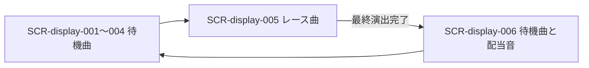

# 画面設計: 会場BGM・効果音

## ユースケースと画面の対応

| UC-ID | 必要な画面 |
|-------|------------|
| UC-audio-001 | SCR-display-001〜006 |
| UC-audio-002 | SCR-display-002〜006 |
| UC-audio-003 | SCR-display-001〜006 |

## 画面一覧

| SCR-ID | 名前 | ルート | 主な操作 | 呼ぶAPI |
|--------|------|--------|----------|---------|
| SCR-display-001 | 参加受付 | 既存会場画面 | 既存Enter | 追加なし |
| SCR-display-002 | 公開カード | 既存会場画面 | 既存Enter | 追加なし |
| SCR-display-003 | マ券ドラフト共有 | 既存会場画面 | 既存Enter | 追加なし |
| SCR-display-004 | 仕込み〜準備完了 | 既存会場画面 | 既存Enter | 追加なし |
| SCR-display-005 | レース進行 | 既存会場画面 | 既存Enter | 追加なし |
| SCR-display-006 | 着順・結果 | 既存会場画面 | 既存Enter | 追加なし |

## 画面遷移



既存のゲーム進行に従う。音声は遷移を発生させない。

## 対応マトリクス

| SCR-ID | 画面 | 関連REQ | 呼ぶAPI | 主コンポーネント | 遷移先 |
|--------|------|---------|---------|------------------|--------|
| SCR-display-001〜006 | 会場共通フッター | REQ-audio-001 | 追加なし | CMP-audio-001 | 既存遷移 |

## SCR-display-001〜006: 音源クレジット

### 目的

音源の作者・配布元・利用条件を常時参照できるようにする。

### レイアウト

| エリア | 要素 | 動作 |
|--------|------|------|
| 1280×720の最下部16px | Run Amok / Kevin MacLeod / incompetech.com / CC BY 4.0 / ライセンスURL | 操作なし、同梱CREDITS.txtにも全文 |

### ワイヤー（ASCII）

```text
┌──────────────────────────────────────┐
│ 既存のゲーム画面・Enter案内            │
├──────────────────────────────────────┤
│ Run Amok / Kevin MacLeod / CC BY 4.0… │
└──────────────────────────────────────┘
```

### 状態

| 状態 | 見た目・振る舞い |
|------|------------------|
| 初期・再生中 | 同じ帰属表示 |
| エラー | 音声障害はログへ記録。画面・操作は継続 |

### 操作と結果

| 操作 | 条件 | 結果 |
|------|------|------|
| 既存Enter | 既存の進行条件を満たす | 画面変化に音が追従。音声専用のキーなし |
