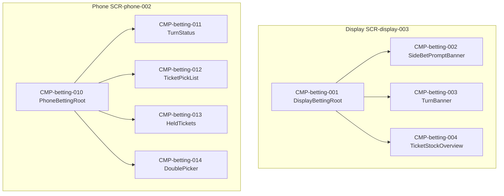

# UIコンポーネント: マ券・サイドベット

## コンポーネントツリー

## コンポーネント一覧

| CMP-ID | 名前 | 役割 | 親 | 主な入出力 |
|--------|------|------|-----|------------|
| CMP-betting-001 | DisplayBettingRoot | Display ドラフト共有の組み立て | — | betting.state |
| CMP-betting-002 | SideBetPromptBanner | お題文面 | CMP-betting-001 | prompt |
| CMP-betting-003 | TurnBanner | 手番プレイヤー強調 | CMP-betting-001 | currentPlayerId |
| CMP-betting-004 | TicketStockOverview | 残り札概要 | CMP-betting-001 | stock[] |
| CMP-betting-010 | PhoneBettingRoot | Phone ドラフト画面 | — | betting.state, playerId |
| CMP-betting-011 | TurnStatus | 自分番／待ち | CMP-betting-010 | currentPlayerId |
| CMP-betting-012 | TicketPickList | 札一覧・裏返し・確定 | CMP-betting-010 | stock → API-BETTING-002 |
| CMP-betting-013 | HeldTickets | 所持2枠 | CMP-betting-010 | picks |
| CMP-betting-014 | DoublePicker | 第3の1枚ダブル | CMP-betting-010 | → API-BETTING-003 |
