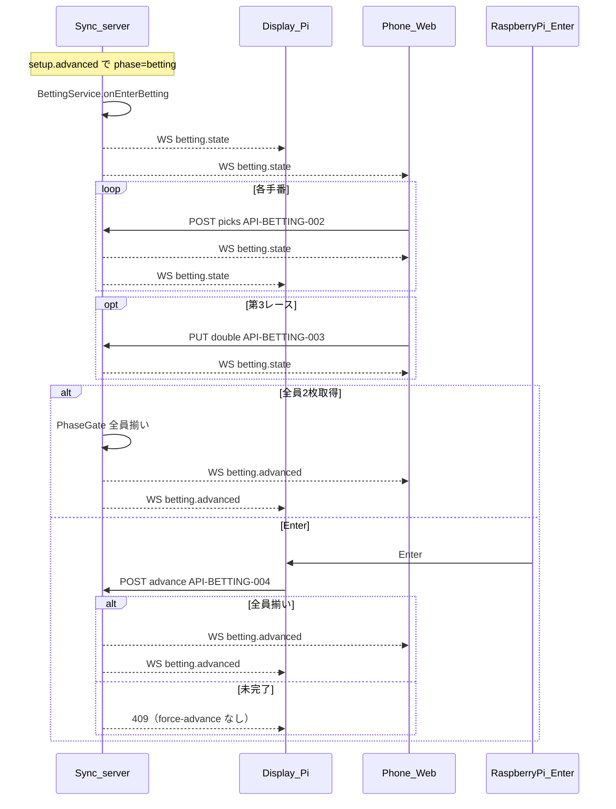

# フロー: マ券・サイドベット

## シーケンス

## 状態遷移

| 状態 | イベント | 次の状態 |
|------|----------|----------|
| entering | setup.advanced | drafting |
| drafting | pick（未完了） | drafting |
| drafting | 全員2枚（＋第3ダブル） | all_ready |
| all_ready | 自動または Enter | advanced |
| drafting | Enter（未完了） | 409（force-advance なし） |
| advanced | — | card-seed |

フェーズ: `betting` → `card-seed`。
