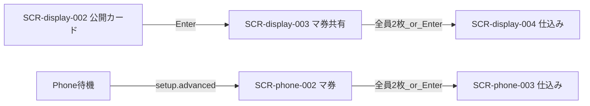

# 画面設計: マ券・サイドベット

## ユースケースと画面の対応

| UC-ID | 必要な画面 |
|-------|------------|
| UC-betting-001 | SCR-phone-002 |
| UC-betting-002 | SCR-phone-002 |
| UC-betting-003 | SCR-phone-002 |
| UC-betting-004 | SCR-display-003 |
| UC-betting-005 | SCR-phone-002, SCR-display-003 |
| UC-betting-006 | SCR-display-003 |

## 画面一覧

| SCR-ID | 名前 | ルート | 主な操作 | 呼ぶAPI |
|--------|------|--------|----------|---------|
| SCR-phone-002 | マ券ドラフト | `/play/{sessionId}/betting` | 札選択・裏返し・確定・ダブル指定 | API-BETTING-001〜003 |
| SCR-display-003 | マ券ドラフト共有 | （Display 全画面） | なし（Enter 連携） | API-BETTING-001, 004 |

## 画面遷移



※ SCR-display-004 / SCR-phone-003 は card-seed 設計で詳細化。

## 対応マトリクス

| SCR-ID | 画面 | 関連REQ | 呼ぶAPI | 主コンポーネント | 遷移先 |
|--------|------|---------|---------|------------------|--------|
| SCR-phone-002 | マ券ドラフト | REQ-betting-001〜005 | API-BETTING-001〜003 | CMP-betting-010〜014 | SCR-phone-003 |
| SCR-display-003 | マ券共有 | REQ-betting-003, 006 | API-BETTING-001, 004 | CMP-betting-001〜004 | SCR-display-004 |

---

## SCR-phone-002: マ券ドラフト

### 目的

スネークドラフトでマ券またはサイドベットを2枚取得し、各取得直後にセーフ／リスキーを選ぶ。第3レースでは2枚のうち1枚を配当ダブルに指定する。

### レイアウト

| エリア | 要素 | 動作 |
|--------|------|------|
| 手番バー | 「あなたの番」、周回・何人目 | 手番時のみ操作可 |
| メタ | レース n/3 | 表示 |
| リスト | 取得可能な札（配当・残り枚数・セーフ／リスキー） | タップで選択・裏返し |
| 所持 | 自分が取った札（最大2・空き枠） | 表示 |
| 第3追加 | ダブルにする札の指定 | 2枚目取得後 |
| フッター | この札に投票する | 手番で確定 |

### ワイヤー（ASCII）

```
+---------------------------+
| あなたの番です  2周目 3/4 |
| レース 1/3                |
|                           |
| > マ券A [セーフ]          |
|   タップで裏返す→リスキー |
|   残り 2枚                |
|   サイド YES/NO  (お題)   |
|                           |
| 所持中のマ券              |
| [マ券B リスキー] [ 空き ] |
|                           |
| [ この札に投票する ]      |
+---------------------------+
```

### 状態

| 状態 | 見た目・振る舞い |
|------|------------------|
| 他者の番 | 操作不可、手番待ち |
| 自分の番 | 選択・裏返し・確定可 |
| 在庫0 | 該当札を無効表示 |
| 第3・ダブル未指定 | 2枚目後に指定を促す |

### 操作と結果

| 操作 | 条件 | 結果 |
|------|------|------|
| 札を裏返す | 自分の番・選択中 | セーフ⇔リスキー |
| 投票確定 | 自分の番・在庫あり | API-BETTING-002・次手番 |
| ダブル指定 | 第3・所持2枚 | API-BETTING-003 |

金額表示は `features/payout/README.md` 観測確定表を参照（OPEN-betting-005／OPEN-payout-002）。

---

## SCR-display-003: マ券ドラフト共有

### 目的

サイドベットお題と、ドラフト中の残り札／手番を会場に見せる。

### レイアウト

| エリア | 要素 | 動作 |
|--------|------|------|
| お題 | 今レースのサイドベット文面 | 同期 |
| リスト | 残りマ券の概要 | 同期 |
| 手番 | 今誰の番か | 強調 |
| フッター | Enter 案内 | Enter → advance |

### ワイヤー（ASCII）

```
+------------------------------------------+
| マ券ドラフト中                            |
| サイドベット: 「（お題文面）」            |
| 手番: （プレイヤー名）                    |
| 残りマ券: （色ごと残枚）                  |
| ラズパイ Enter で仕込みへ可               |
+------------------------------------------+
```

### 操作と結果

| 操作 | 条件 | 結果 |
|------|------|------|
| （会場）ラズパイ Enter | 全員2枚＋第3は double 済み | API-BETTING-004・card-seed へ |
