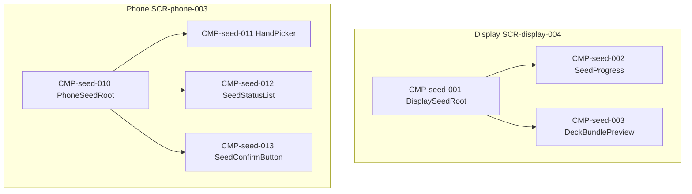

# UIコンポーネント: カード仕込み

## コンポーネントツリー

## コンポーネント一覧

| CMP-ID | 名前 | 役割 | 親 | 主な入出力 |
|--------|------|------|-----|------------|
| CMP-seed-001 | DisplaySeedRoot | Display 仕込み画面 | — | seed.state |
| CMP-seed-002 | SeedProgress | 進捗 n/人数 | CMP-seed-001 | progress |
| CMP-seed-003 | DeckBundlePreview | 束枚数プレビュー | CMP-seed-001 | deckCountExpected |
| CMP-seed-010 | PhoneSeedRoot | Phone 仕込み画面 | — | seed.state, hand |
| CMP-seed-011 | HandPicker | 手札選択 | CMP-seed-010 | handCardId |
| CMP-seed-012 | SeedStatusList | 全員の済／未 | CMP-seed-010 | progress |
| CMP-seed-013 | SeedConfirmButton | 仕込み確定 | CMP-seed-010 | → API-SEED-002 |
