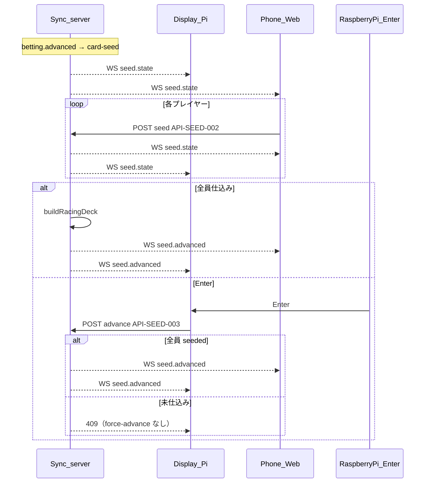

# フロー: カード仕込み

## シーケンス

## 状態遷移

| 状態 | イベント | 次の状態 |
|------|----------|----------|
| seeding | seed（一部） | seeding |
| seeding | 全員 seeded | deck_ready |
| deck_ready | 自動または Enter | advanced |
| seeding | Enter（未仕込み） | 409（force-advance なし） |
| advanced | — | race |

フェーズ: `card-seed` → `race`。
