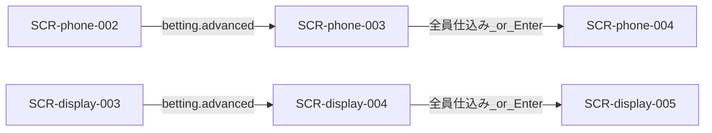

# 画面設計: カード仕込み

## ユースケースと画面の対応

| UC-ID | 必要な画面 |
|-------|------------|
| UC-seed-001 | SCR-phone-003 |
| UC-seed-002 | SCR-display-004 |
| UC-seed-003 | SCR-display-004 |
| UC-seed-004 | SCR-display-004 |

## 画面一覧

| SCR-ID | 名前 | ルート | 主な操作 | 呼ぶAPI |
|--------|------|--------|----------|---------|
| SCR-phone-003 | カード仕込み | `/play/{sessionId}/seed` | 手札1枚選択・確定 | API-SEED-001, 002 |
| SCR-display-004 | 仕込み〜準備完了 | （Display 全画面） | なし（Enter 連携） | API-SEED-001, 003 |

## 画面遷移



## 対応マトリクス

| SCR-ID | 画面 | 関連REQ | 呼ぶAPI | 主コンポーネント | 遷移先 |
|--------|------|---------|---------|------------------|--------|
| SCR-phone-003 | カード仕込み | REQ-seed-001, 003 | API-SEED-001, 002 | CMP-seed-010〜013 | SCR-phone-004 |
| SCR-display-004 | 仕込み〜準備 | REQ-seed-002, 003, 004 | API-SEED-001, 003 | CMP-seed-001〜003 | SCR-display-005 |

---

## SCR-phone-003: カード仕込み

### 目的

手札3枚から1枚をレーシングデッキへ仕込む。制限時間による強制遷移はしない。

### レイアウト

| エリア | 要素 | 動作 |
|--------|------|------|
| メタ | レース n/3、手札枚数、仕込み進捗 | 表示 |
| 手札 | 最大3枚（効果テキスト） | 1枚選択 |
| 状況 | 各プレイヤーの仕込み済／未 | 同期 |
| フッター | このカードを仕込む、Enter／全員待ち | 確定 |

### ワイヤー（ASCII）

```
+---------------------------+
| カードを1枚仕込む         |
| レース 2/3 ・ 手札3枚     |
| 仕込み 2 / 4 人           |
|                           |
| [カードA] [カードC] [E]   |
|                           |
| 仕込み状況                |
| ヤマダ（自分）  選択中    |
| サトウ          済        |
|                           |
| [ このカードを仕込む ]    |
| 全員済、または Enter で次 |
+---------------------------+
```

### 操作と結果

| 操作 | 条件 | 結果 |
|------|------|------|
| カード選択 | 未確定 | ハイライト |
| 仕込み確定 | 1枚選択済 | API-SEED-002 |
| 全員完了 | 全員済 | race へ |
| Enter | 司会 | 全員 seeded |

---

## SCR-display-004: 仕込み〜準備完了

### 目的

仕込み待ち、束の確定（公開＋仕込み）、まもなく開始を示す。

### レイアウト

| エリア | 要素 | 動作 |
|--------|------|------|
| 仕込み中 | 「スマホで1枚仕込んでください」 | 進捗 n/人数 |
| 束確定 | 裏向きカードの集合イメージ | 枚数（標準18） |
| 準備完了 | 「まもなく開始」 | 遷移直前 |

### ワイヤー（ASCII）

```
+------------------------------------------+
| カード仕込み中  3 / 4 人済                |
| レース用カード束  18 枚                   |
| [?][?][?][?][?] ...                       |
| ラズパイ Enter でレースへ可               |
+------------------------------------------+
```
