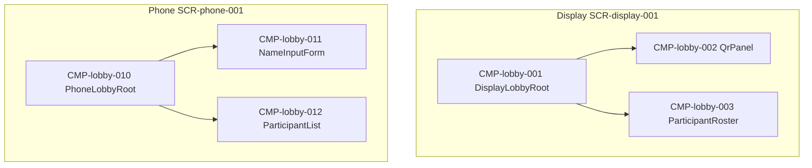

# UIコンポーネント: 参加・ロビー

> screens.md 確定後に記述する。

## コンポーネントツリー

## コンポーネント一覧

| CMP-ID | 名前 | 役割 | 親 | 主な入出力 |
|--------|------|------|-----|------------|
| CMP-lobby-001 | DisplayLobbyRoot | Display ロビー画面の組み立て | — | sessionId, lobby.state |
| CMP-lobby-002 | QrPanel | joinUrl の QR 描画 | CMP-lobby-001 | joinUrl |
| CMP-lobby-003 | ParticipantRoster | 人数・参加者一覧（Display） | CMP-lobby-001 | players[], maxPlayers |
| CMP-lobby-010 | PhoneLobbyRoot | Phone ロビー画面の組み立て | — | playerId, lobby.state |
| CMP-lobby-011 | NameInputForm | 名前入力と確定ボタン | CMP-lobby-010 | displayName → API-LOBBY-004 |
| CMP-lobby-012 | ParticipantList | 参加者一覧（Phone） | CMP-lobby-010 | players[], selfPlayerId |
