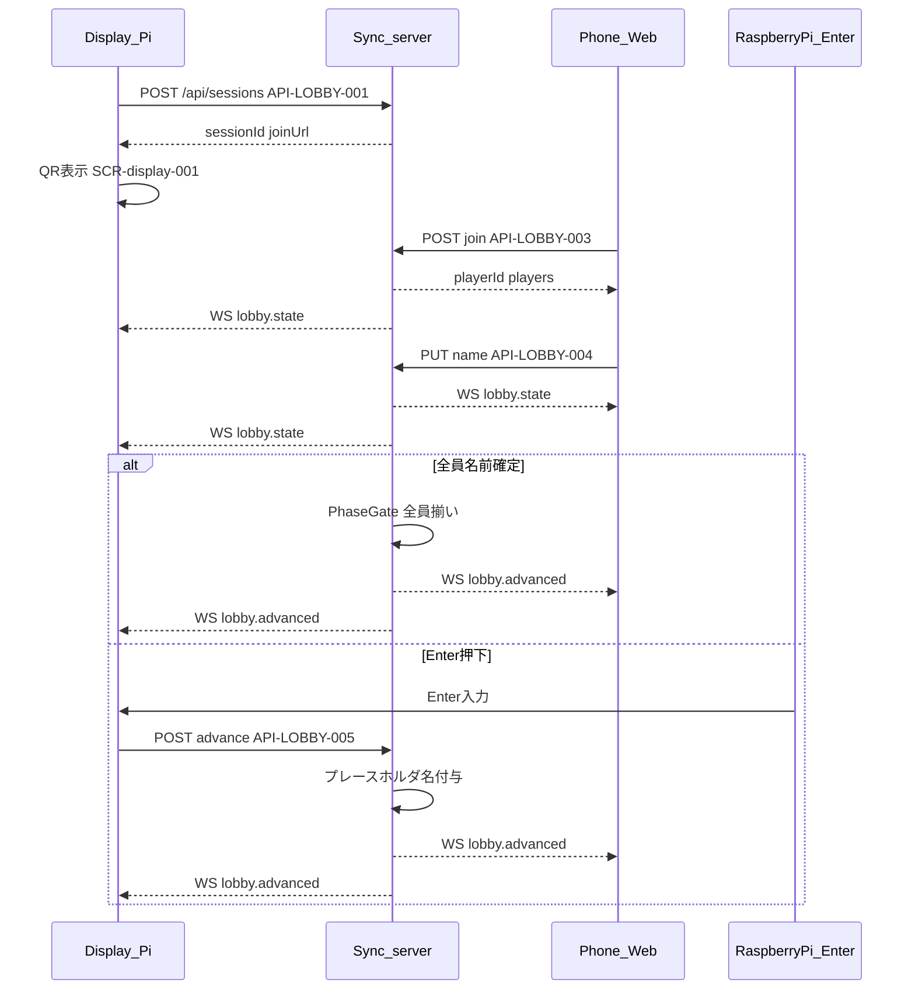

# フロー: 参加・ロビー

## シーケンス

## 状態遷移

| 状態 | イベント | 次の状態 |
|------|----------|----------|
| waiting_join | 1人目 join | name_pending |
| name_pending | 名前確定（一部） | name_pending |
| name_pending | 全員 nameReady | all_ready |
| all_ready | 自動または Enter | advanced |
| name_pending | Enter（3人以上） | advanced |
| advanced | — | setup-cards（別機能） |

フェーズ（GameSession.phase）: `lobby` → `setup-cards`。
