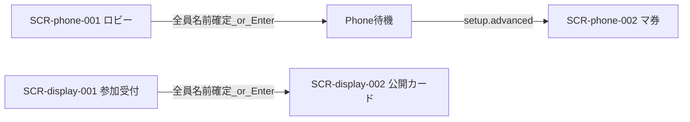

# 画面設計: 参加・ロビー

## ユースケースと画面の対応

| UC-ID | 必要な画面 |
|-------|------------|
| UC-lobby-001 | SCR-phone-001 |
| UC-lobby-002 | SCR-phone-001 |
| UC-lobby-003 | SCR-display-001 |
| UC-lobby-004 | SCR-display-001 |
| UC-lobby-005 | SCR-phone-001, SCR-display-001 |

## 画面一覧

| SCR-ID | 名前 | ルート | 主な操作 | 呼ぶAPI |
|--------|------|--------|----------|---------|
| SCR-phone-001 | ロビー（参加） | `/join/{sessionId}` | 名前入力・確定 | API-LOBBY-003, 004 |
| SCR-display-001 | 参加受付 | （Display 全画面） | なし（QR 提示・Enter 連携） | API-LOBBY-001, 002, 005 |

## 画面遷移



※ 公開カード中は Phone 専用 SCR なし（待機）。SCR-display-002 は [setup-cards](../setup-cards/screens.md)、SCR-phone-002 は betting 設計で詳細化。

## 対応マトリクス

| SCR-ID | 画面 | 関連REQ | 呼ぶAPI | 主コンポーネント | 遷移先 |
|--------|------|---------|---------|------------------|--------|
| SCR-phone-001 | ロビー（参加） | REQ-lobby-002, 003, 004 | API-LOBBY-003, 004 | CMP-lobby-010, 011, 012 | SCR-phone-002 |
| SCR-display-001 | 参加受付 | REQ-lobby-001, 003, 006, 007 | API-LOBBY-001, 002, 005 | CMP-lobby-001, 002, 003 | SCR-display-002 |

---

## SCR-phone-001: ロビー（参加）

### 目的

QR 参加後に名前を確定し、参加者一覧を共有する。セットアップ完了は **全員の名前確定**、または **ラズパイ Enter**。

### レイアウト

| エリア | 要素 | 動作 |
|--------|------|------|
| ヘッダー | タイトル「ホットストリーク」、案内文 | 表示のみ |
| 入力 | プレイヤー名フィールド | テキスト入力 |
| サマリー | 参加者人数 | 全端末同期で更新 |
| リスト | 参加者行（自分／他者・入力済／入力中） | 名前確定で反映 |
| フッター | 「この名前で決定」、Enter／全員待ち案内 | 確定ボタンでリスト更新 |

### ワイヤー（ASCII）

```
+---------------------------+
| ホットストリーク          |
| QRを読み取って参加        |
|                           |
| プレイヤー名              |
| [ ヤマダ|               ] |
|                           |
|     参加者  4 人          |
| ヤマダ（自分）    入力済  |
| サトウ            入力済  |
| プレイヤー3       入力中  |
| プレイヤー4       入力中  |
|                           |
| [ この名前で決定 ]        |
| 全員入力後、または        |
| ラズパイ Enter で次へ     |
+---------------------------+
```

### 状態

| 状態 | 見た目・振る舞い |
|------|------------------|
| 未入力 | 確定不可または空名拒否 |
| 入力中 | カーソル表示 |
| 自分確定済 | 自分行が入力済、他端末に配信 |
| 待機 | 全員揃い待ち、または Enter 待ち |
| 受付終了 | lobby.advanced 受信後、次画面へ |

### 操作と結果

| 操作 | 条件 | 結果 |
|------|------|------|
| 名前確定 | 非空 | API-LOBBY-004 呼び出し・参加者リスト更新・配信 |
| 全員名前確定 | 参加者全員 nameReady | setup-cards へ（lobby.advanced） |
| ラズパイ Enter | 司会進行 | 同上（未確定はプレースホルダ名） |

---

## SCR-display-001: 参加受付

### 目的

QR を大きく示し、参加者数とアイコン／名前一覧を更新する。

### レイアウト

| エリア | 要素 | 動作 |
|--------|------|------|
| 左 | QR コード | 参加用 joinUrl |
| 右 | 人数 n/8、参加者リスト | 参加・名前確定のたびに同期更新 |

### ワイヤー（ASCII）

```
+------------------------------------------+
| 参加受付                                  |
| +--------+   参加者  6 / 8               |
| |  QR    |   [熊]くま  [魚]さかな ...     |
| |        |   ---- 空き枠 ----             |
| +--------+                                |
+------------------------------------------+
```

### 状態

| 状態 | 見た目・振る舞い |
|------|------------------|
| 受付中 | QR 有効・リスト増加 |
| 全員揃い | 進行可能（Enter または自動遷移の案内） |
| 締め | Enter 後は受付停止・SCR-display-002 へ |

### 操作と結果

| 操作 | 条件 | 結果 |
|------|------|------|
| （会場）ラズパイ Enter | 参加者 3 人以上 | API-LOBBY-005・setup-cards へ |
| 全員名前確定 | 参加者全員 | 同上（揃いでも可） |
