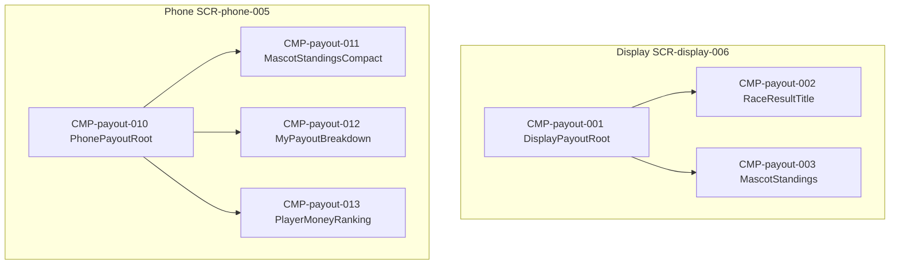

# UIコンポーネント: 配当

## コンポーネントツリー

## コンポーネント一覧

| CMP-ID | 名前 | 役割 | 親 | 主な入出力 |
|--------|------|------|-----|------------|
| CMP-payout-001 | DisplayPayoutRoot | Display 結果画面 | — | payout.state |
| CMP-payout-002 | RaceResultTitle | RACE n RESULT | CMP-payout-001 | raceIndex |
| CMP-payout-003 | MascotStandings | 1〜4位 | CMP-payout-001 | standings |
| CMP-payout-010 | PhonePayoutRoot | Phone 配当画面 | — | payout.state |
| CMP-payout-011 | MascotStandingsCompact | 着順要約 | CMP-payout-010 | standings |
| CMP-payout-012 | MyPayoutBreakdown | 個人内訳 | CMP-payout-010 | myBreakdown |
| CMP-payout-013 | PlayerMoneyRanking | 所持金順位 | CMP-payout-010 | balances |
