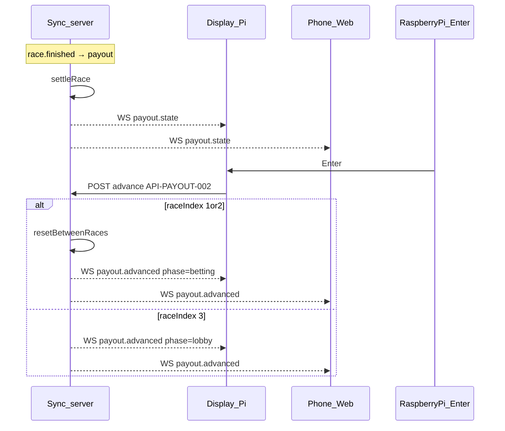

# フロー: 配当

## シーケンス

## 状態遷移

| 状態 | イベント | 次の状態 |
|------|----------|----------|
| settling | race.finished | showing |
| showing | Enter (n<3) | between_reset → betting |
| showing | Enter (n=3) | lobby |

フェーズ: `payout` → `betting` または `lobby`。
