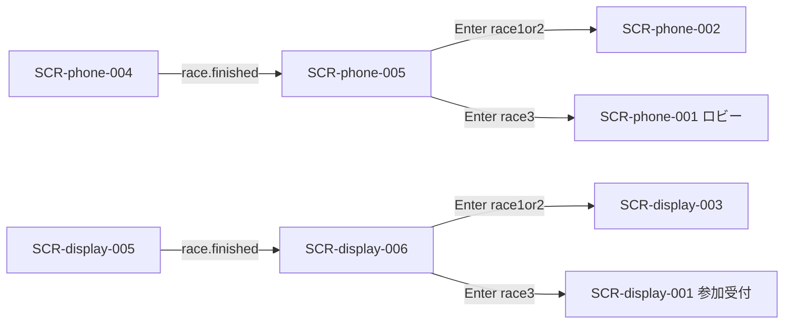

# 画面設計: 配当

## ユースケースと画面の対応

| UC-ID | 必要な画面 |
|-------|------------|
| UC-payout-001 | （サーバ） |
| UC-payout-002 | SCR-phone-005 |
| UC-payout-003 | SCR-display-006 |
| UC-payout-004 | SCR-display-006 |

## 画面一覧

| SCR-ID | 名前 | ルート | 主な操作 | 呼ぶAPI |
|--------|------|--------|----------|---------|
| SCR-phone-005 | 配当 | `/play/{sessionId}/payout` | なし（閲覧） | API-PAYOUT-001 |
| SCR-display-006 | 着順・結果 | （Display 全画面） | Enter 連携 | API-PAYOUT-001, 002 |

## 画面遷移



## 対応マトリクス

| SCR-ID | 画面 | 関連REQ | 呼ぶAPI | 主コンポーネント | 遷移先 |
|--------|------|---------|---------|------------------|--------|
| SCR-phone-005 | 配当 | REQ-payout-001〜005 | API-PAYOUT-001 | CMP-payout-010〜013 | 002 または 001 |
| SCR-display-006 | 着順・結果 | REQ-payout-005, 006 | API-PAYOUT-001, 002 | CMP-payout-001〜003 | 003 または 001 |

---

## SCR-phone-005: 配当

### 目的

着順と自分の払戻・全員の所持金順位を見せる。次へは Enter。

### レイアウト

| エリア | 要素 | 動作 |
|--------|------|------|
| タイトル | レース n 結果 | 表示 |
| 着順 | マスコット1〜4位 | 表示 |
| 自分 | 獲得金額・内訳（ダブル明示） | 表示 |
| 順位 | プレイヤー別所持金 | 自分強調 |
| フッター | Enter 案内 | 表示 |

### ワイヤー（ASCII）

```
+---------------------------+
| レース1 結果              |
| 着順  [1][2][3][4]        |
| あなたの獲得金額          |
| （内訳）                  |
| プレイヤー順位            |
| ラズパイ Enter で次へ     |
+---------------------------+
```

金額表示は README 観測確定表を参照。

---

## SCR-display-006: 着順・結果

### 目的

表彰・着順を大きく見せる。個人払戻の詳細は Phone。

### レイアウト

| エリア | 要素 | 動作 |
|--------|------|------|
| タイトル | RACE n RESULT | 表示 |
| 順位 | 1〜4位マスコット | 表示 |
| フッター | Enter 案内 | Enter → advance |

### 操作と結果

| 操作 | 条件 | 結果 |
|------|------|------|
| Enter | 配当表示中 | 次 betting、または lobby（レース3） |
