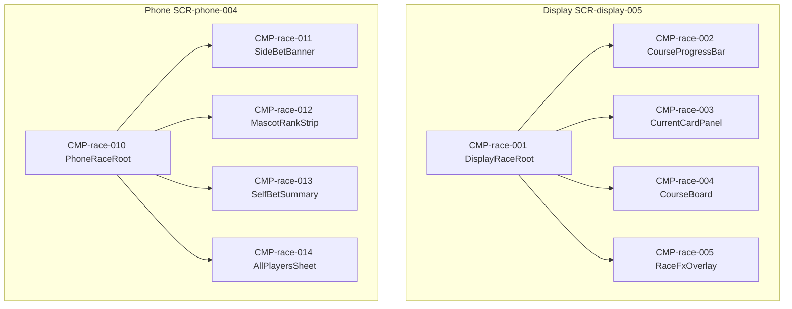

# UIコンポーネント: レース進行

## コンポーネントツリー

## コンポーネント一覧

| CMP-ID | 名前 | 役割 | 親 | 主な入出力 |
|--------|------|------|-----|------------|
| CMP-race-001 | DisplayRaceRoot | Display レース画面 | — | race.state |
| CMP-race-002 | CourseProgressBar | START〜GOAL | CMP-race-001 | mascots |
| CMP-race-003 | CurrentCardPanel | 今回のカード | CMP-race-001 | currentCard |
| CMP-race-004 | CourseBoard | コースと駒 | CMP-race-001 | course, mascots |
| CMP-race-005 | RaceFxOverlay | バーン／GO／短縮 | CMP-race-001 | fxPhase |
| CMP-race-010 | PhoneRaceRoot | Phone 観戦 | — | race.state |
| CMP-race-011 | SideBetBanner | お題 | CMP-race-010 | prompt |
| CMP-race-012 | MascotRankStrip | 簡易順位 | CMP-race-010 | mascots |
| CMP-race-013 | SelfBetSummary | 自分の札・所持金・順位 | CMP-race-010 | myBets, balance |
| CMP-race-014 | AllPlayersSheet | 004b 全員札 | CMP-race-010 | picksByPlayer |
