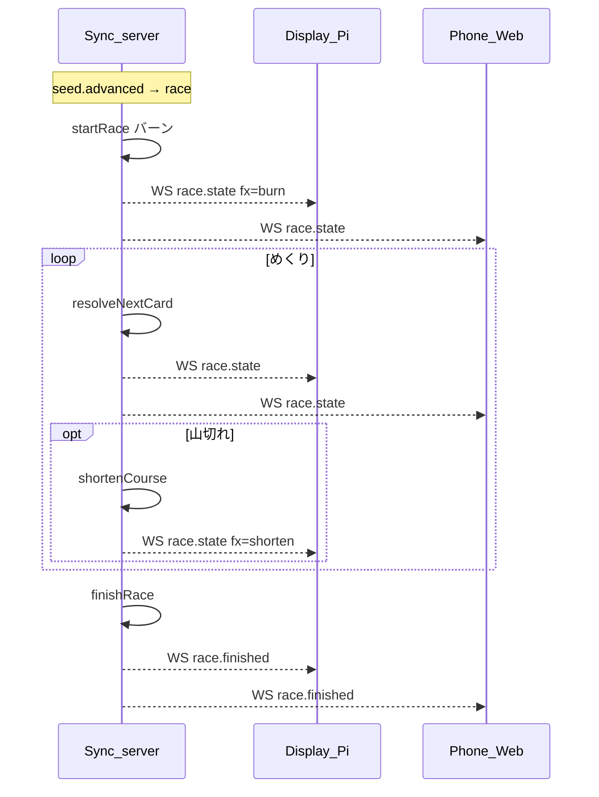

# フロー: レース進行

## シーケンス

## 状態遷移

| 状態 | イベント | 次の状態 |
|------|----------|----------|
| starting | burn+GO | resolving |
| resolving | card resolved | resolving |
| resolving | deck empty | shortening |
| shortening | done | resolving |
| resolving | 3 finished | finished |
| finished | — | payout |

フェーズ: `race` → `payout`。
