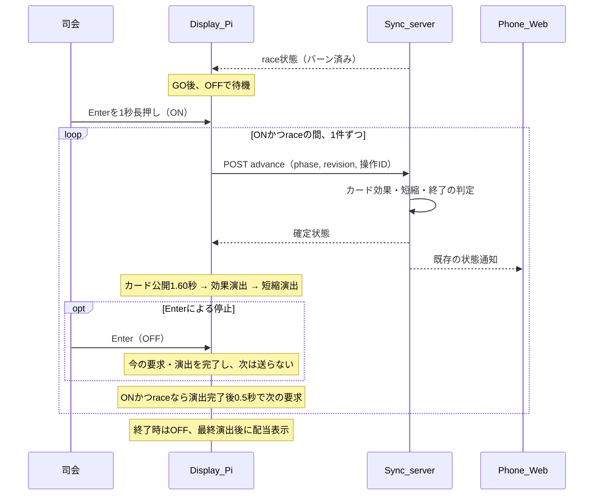

# フロー: レース進行

## シーケンス

```mermaid
sequenceDiagram
  participant Host as 司会
  participant Display as Display_Pi
  participant Sync as Sync_server
  participant Phone as Phone_Web
  Sync-->>Display: race状態（バーン済み）
  Note over Display: GO後、OFFで待機
  Host->>Display: Enterを1秒長押し（ON）
  loop ONかつraceの間、1件ずつ
    Display->>Sync: POST advance（phase, revision, 操作ID）
    Sync->>Sync: カード効果・短縮・終了の判定
    Sync-->>Display: 確定状態
    Sync-->>Phone: 既存の状態通知
    Note over Display: カード公開1.60秒 → 効果演出 → 短縮演出
    opt Enterによる停止
      Host->>Display: Enter（OFF）
      Note over Display: 今の要求・演出を完了し、次は送らない
    end
    Note over Display: ONかつraceなら演出完了後0.5秒で次の要求
  end
  Note over Display: 終了時はOFF、最終演出後に配当表示
```

## 状態遷移

| 状態 | イベント | 次の状態 |
|------|----------|----------|
| starting | burn+GO | paused（OFF） |
| paused | Enterを1秒未満で離す | stopping（OFF、1枚要求して演出後に停止） |
| paused | Enterを1秒長押し | running（ON、1枚要求） |
| running | 応答・全演出完了 | interval（ON、0.5秒待機） |
| interval | 0.5秒経過 | running（次の1枚要求） |
| running | Enter | stopping（OFF、処理済みカードの演出を完了） |
| interval | Enter | paused（OFF、次は送らない） |
| stopping | 全演出完了 | paused |
| stopping | Enterを1秒長押し | running（ON、現在の要求・演出完了を待つ） |
| running / interval / stopping / paused | 通信失敗・操作エラー・フォーカス喪失 | OFF（送信済みの確定結果のみ反映） |
| OFF（通信確認中） | 最新状態取得 | paused（短押しで1枚・1秒長押しで自動再開） |
| 任意 | race以外の状態受信 | OFF（最終演出後に次フェーズを表示） |

フェーズ: `race` → `payout`。ON/OFFはフェーズを変更しない。新しいレースとアプリ再起動は必ずOFF。長押しの1秒到達時に一度だけONにし、キーリピートでは状態遷移しない。自動中の停止操作を長押ししても再開しない。
