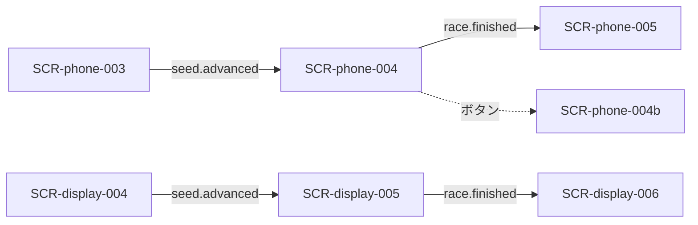

# 画面設計: レース進行

## ユースケースと画面の対応

| UC-ID | 必要な画面 |
|-------|------------|
| UC-race-001 | SCR-display-005 |
| UC-race-002 | SCR-display-005 |
| UC-race-003 | SCR-display-005 → payout 画面 |
| UC-race-004 | SCR-phone-004 |
| UC-race-005 | SCR-phone-004b |

## 画面一覧

| SCR-ID | 名前 | ルート | 主な操作 | 呼ぶAPI |
|--------|------|--------|----------|---------|
| SCR-phone-004 | レース観戦 | `/play/{sessionId}/race` | 全員状況ボタン | API-RACE-001 |
| SCR-phone-004b | 全員状況 | （モーダル） | 閉じる | API-RACE-001 |
| SCR-display-005 | レース進行 | （Display 全画面） | Enterで1枚めくる（効果は自動演出） | API-RACE-001 |

## 画面遷移



## 対応マトリクス

| SCR-ID | 画面 | 関連REQ | 呼ぶAPI | 主コンポーネント | 遷移先 |
|--------|------|---------|---------|------------------|--------|
| SCR-phone-004 | レース観戦 | REQ-race-005 | API-RACE-001 | CMP-race-010〜013 | SCR-phone-005 |
| SCR-phone-004b | 全員状況 | REQ-race-006 | API-RACE-001 | CMP-race-014 | 閉じると 004 |
| SCR-display-005 | レース進行 | REQ-race-001〜004 | API-RACE-001 | CMP-race-001〜005 | SCR-display-006 |

---

## SCR-display-005: レース進行

### 目的

バーン、カードめくり、マスコット移動、コース短縮を演出する。レース中にプレイヤー判断は入れない。会場DisplayのEnterで1枚ずつめくり、結果表示後は次のEnterを待つ。

### レイアウト

| エリア | 要素 | 動作 |
|--------|------|------|
| 左上 | RACE番号のみ | 進行度バーは表示しない（ユーザー指示） |
| 右上 | 今回のカード | めくりごと更新 |
| 中央 | コース・マスコット4体 | 移動・向き・転倒 |
| 演出 | 3,2,1 / GO / コース短縮 | フェーズ表示 |

### ワイヤー（ASCII）

```
+------------------------------------------+
| START =====o==o====o====o==== GOAL       |
|                      今回のカード         |
|                      [ 対象 +効果 ]       |
|   （コースグリッド／マスコット）          |
+------------------------------------------+
```

OPEN: マス表現は 4レーン×12（ワイヤー数え上げ）。効果ラベルは manual §6 の種別名。

---

## SCR-phone-004: レース観戦

### 目的

Display を追いながら自分のマ券・所持金・プレイヤー順位を常時表示する。

### レイアウト

| エリア | 要素 | 動作 |
|--------|------|------|
| 上部 | サイドベットお題 | 固定表示 |
| 中央 | マスコット簡易順位 | 同期 |
| 下部 | 自分のマ券・所持金・順位 | 同期 |
| アクション | 全員の状況 | 004b |

### 操作と結果

| 操作 | 条件 | 結果 |
|------|------|------|
| 全員の状況 | レース中 | SCR-phone-004b |
| （自動） | race.finished | SCR-phone-005 |

---

## SCR-phone-004b: 全員状況

### 目的

他プレイヤーの購入マ券（表裏）を一覧参照する。

### 操作と結果

| 操作 | 条件 | 結果 |
|------|------|------|
| 閉じる | 表示中 | SCR-phone-004 に戻る |

## 2026-09-21 ビジュアル修正

ゲーム進行画面-ディスプレイ側.pngの海・島・緑の台形コースを採用。上部の進行度バーは不要というユーザー指示により非表示。右上に今回のカードと効果、左上にゴール順のアイコンと名前を表示。操作案内と下部の処理状況テキストは表示しない。室内背景と金枠の共通基準より本画面の指示を優先する。

左上の確定着順にはゴールと失格の両方を表示する。ゴールは上位から、失格は空いている下位（最初は4位、次は3位）から割り当て、アイコン・名前・失格ラベルを表示。同時失格は同じ低い着順を使う。
