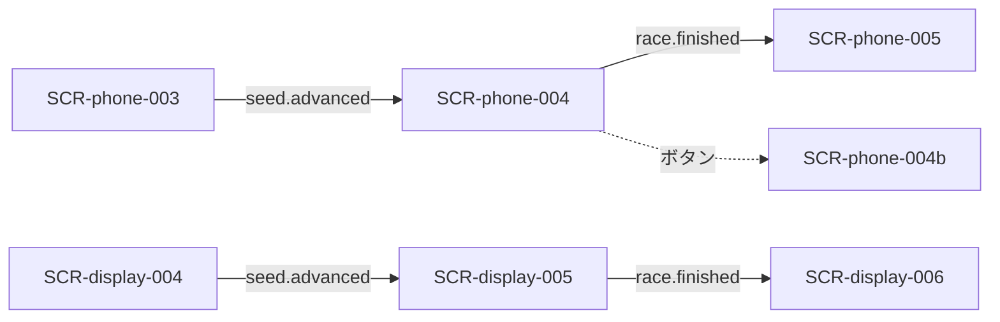

# 画面設計: レース進行

## ユースケースと画面の対応

| UC-ID | 必要な画面 |
|-------|------------|
| UC-race-001 | SCR-display-005 |
| UC-race-002 | SCR-display-005 |
| UC-race-003 | SCR-display-005 → payout 画面 |
| UC-race-004 | SCR-phone-004 |
| UC-race-005 | SCR-phone-004b |
| UC-race-006 | SCR-display-005 |

## 画面一覧

| SCR-ID | 名前 | ルート | 主な操作 | 呼ぶAPI |
|--------|------|--------|----------|---------|
| SCR-phone-004 | レース観戦 | `/play/{sessionId}/race` | 全員状況ボタン | API-RACE-001 |
| SCR-phone-004b | 全員状況 | （モーダル） | 閉じる | API-RACE-001 |
| SCR-display-005 | レース進行 | （Display 全画面） | Enter短押しで1枚・1秒長押しで自動開始 | API-RACE-001, API-RACE-002 |

## 画面遷移


```mermaid
flowchart LR
  SCR_phone_003[SCR-phone-003] -->|seed.advanced| SCR_phone_004[SCR-phone-004]
  SCR_phone_004 -->|race.finished| SCR_phone_005[SCR-phone-005]
  SCR_phone_004 -.->|ボタン| SCR_phone_004b[SCR-phone-004b]
  SCR_display_004[SCR-display-004] -->|seed.advanced| SCR_display_005[SCR-display-005]
  SCR_display_005 -->|race.finished| SCR_display_006[SCR-display-006]
```

## 対応マトリクス

| SCR-ID | 画面 | 関連REQ | 呼ぶAPI | 主コンポーネント | 遷移先 |
|--------|------|---------|---------|------------------|--------|
| SCR-phone-004 | レース観戦 | REQ-race-005 | API-RACE-001 | CMP-race-010〜013 | SCR-phone-005 |
| SCR-phone-004b | 全員状況 | REQ-race-006 | API-RACE-001 | CMP-race-014 | 閉じると 004 |
| SCR-display-005 | レース進行 | REQ-race-001〜004, REQ-race-008 | API-RACE-001, API-RACE-002 | CMP-race-001〜005 | SCR-display-006 |

---

## SCR-display-005: レース進行

### 目的

バーン、カードめくり、マスコット移動、コース短縮を演出する。レース中にプレイヤー判断は入れない。会場DisplayのEnter短押しで1枚、1秒長押しで自動開始、自動中の押下で停止する。カードと効果の演出完了後に次の1枚を要求する。

### レイアウト

| エリア | 要素 | 動作 |
|--------|------|------|
| 左上 | RACE番号のみ | 進行度バーは表示しない（ユーザー指示） |
| 右上 | 今回のカード | めくりごと更新 |
| 中央 | コース・マスコット4体 | 移動・向き・転倒 |
| 演出 | 3,2,1 / GO / コース短縮 | フェーズ表示 |
| 左上のRACE番号の右隣 | 自動進行状態・Enter案内 | 待機「Enterで1枚 / 1秒長押しで自動開始」、ON「自動進行中 / Enterで一時停止」、停止途中「このカードの演出後に停止 / 1秒長押しで自動再開」、停止済み「一時停止中 / Enterで1枚・1秒長押しで自動再開」 |

通信失敗時は「通信確認中 / 自動進行を停止しました」。最新状態を取得するまでは再開しない。案内は既存カード・履歴・エラー表示と重ならない位置に置く。

### ワイヤー（ASCII）

```
+------------------------------------------+
| START =====o==o====o====o==== GOAL       |
|                      今回のカード         |
|                      [ 対象 +効果 ]       |
|   （コースグリッド／マスコット）          |
+------------------------------------------+
```

マス表現は4レーン×13マス＋GOAL（STARTは3、★は3・8・13）。効果ラベルは manual §6 の種別名。

---

## SCR-phone-004: レース観戦

### 目的

Display を追いながら自分のマ券・所持金・プレイヤー順位を常時表示する。

### レイアウト

| エリア | 要素 | 動作 |
|--------|------|------|
| 上部 | サイドベットお題 | 固定表示 |
| 中央 | マスコット簡易順位 | 同期 |
| 下部 | 自分のマ券・所持金・順位 | 同期 |
| アクション | 全員の状況 | 004b |

### 操作と結果

| 操作 | 条件 | 結果 |
|------|------|------|
| 全員の状況 | レース中 | SCR-phone-004b |
| （自動） | race.finished | SCR-phone-005 |

---

## SCR-phone-004b: 全員状況

### 目的

他プレイヤーの購入マ券（表裏）を一覧参照する。

### 操作と結果

| 操作 | 条件 | 結果 |
|------|------|------|
| 閉じる | 表示中 | SCR-phone-004 に戻る |

## 2026-09-21 ビジュアル修正

ゲーム進行画面-ディスプレイ側.pngの海・島・緑の台形コースを採用。上部の進行度バーは不要というユーザー指示により非表示。右上に今回のカードと効果、左上にゴール順のアイコンと名前を表示。従来は操作案内を非表示としていたが、2026-10-08の自動進行変更ではRACE番号の右隣に開始／停止状態とEnter案内を表示する。開始カウントとGOも同じ位置に表示し、中央の開始案内と下部の状態帯は表示しない（2026-10-08ユーザー指定）。室内背景と金枠の共通基準より本画面の指示を優先する。

左上の確定着順にはゴールと失格の両方を表示する。ゴールは上位から、失格は空いている下位（最初は4位、次は3位）から割り当て、順位（○位）・アイコン・名前のみを表示し、失格・ゴールのラベルは付けない。同時失格は同じ低い着順を使う。
