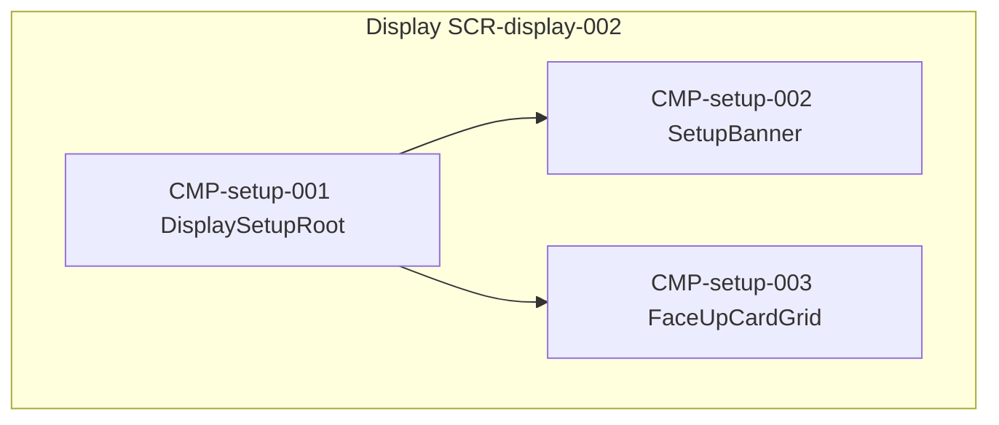

# UIコンポーネント: 公開カード準備

## コンポーネントツリー

## コンポーネント一覧

| CMP-ID | 名前 | 役割 | 親 | 主な入出力 |
|--------|------|------|-----|------------|
| CMP-setup-001 | DisplaySetupRoot | Display 公開カード画面の組み立て | — | setup.state |
| CMP-setup-002 | SetupBanner | 案内文・人数・枚数 | CMP-setup-001 | playerCount, faceUpCount |
| CMP-setup-003 | FaceUpCardGrid | 公開カードのグリッド／レーン表示 | CMP-setup-001 | faceUpCards[] |
