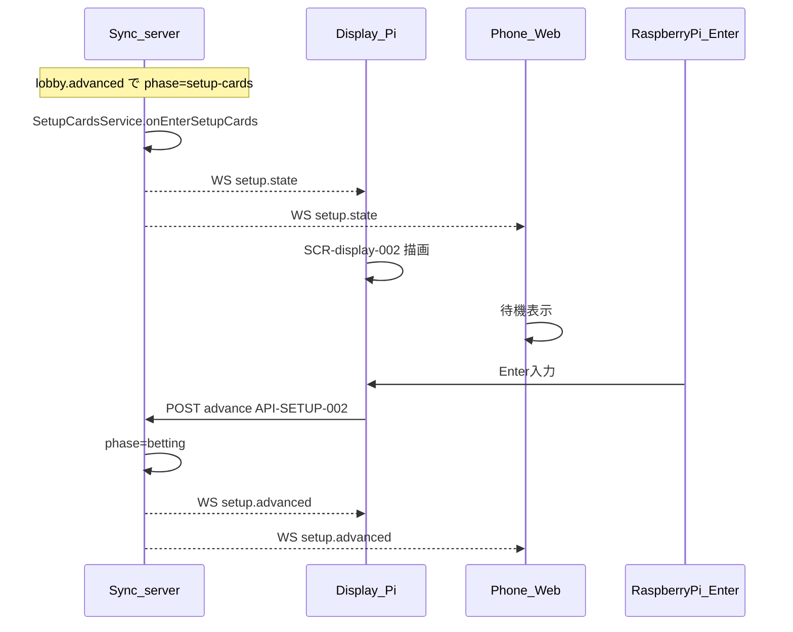

# フロー: 公開カード準備

## シーケンス

## 状態遷移

| 状態 | イベント | 次の状態 |
|------|----------|----------|
| entering | lobby.advanced | dealing |
| dealing | 配布成功 | face_up_ready |
| dealing | 供給不足 | failed（セッション再作成） |
| face_up_ready | Enter | advanced |
| advanced | — | betting（別機能） |

フェーズ（GameSession.phase）: `setup-cards` → `betting`。
