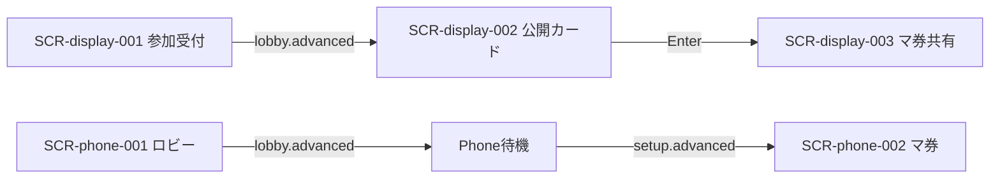

# 画面設計: 公開カード準備

## ユースケースと画面の対応

| UC-ID | 必要な画面 |
|-------|------------|
| UC-setup-001 | （画面なし・サーバ処理） |
| UC-setup-002 | SCR-display-002 |
| UC-setup-003 | （Phone 専用 SCR なし・待機） |
| UC-setup-004 | SCR-display-002 |

## 画面一覧

| SCR-ID | 名前 | ルート | 主な操作 | 呼ぶAPI |
|--------|------|--------|----------|---------|
| SCR-display-002 | 公開カード | （Display 全画面） | なし（Enter 連携） | API-SETUP-001, 002 |

※ Phone 専用画面は設けない（task-breakdown: スマホなし）。`setup-cards` 中の Phone はシェル側の待機表示とし、`setup.advanced` 受信後に SCR-phone-002（betting）へ進む。

## 画面遷移



※ SCR-display-003 / SCR-phone-002 は betting 機能の設計で詳細化する。

## 対応マトリクス

| SCR-ID | 画面 | 関連REQ | 呼ぶAPI | 主コンポーネント | 遷移先 |
|--------|------|---------|---------|------------------|--------|
| SCR-display-002 | 公開カード | REQ-setup-002, 003, 005, 006 | API-SETUP-001, 002 | CMP-setup-001, 002, 003 | SCR-display-003 |

---

## SCR-display-002: 公開カード

### 目的

スターター＋人数分のレースカードを表向きに見せ、マスコットごとの気配を共有する。

### レイアウト

| エリア | 要素 | 動作 |
|--------|------|------|
| 案内 | 「場のカード（公開）」、人数・枚数説明 | 表示のみ |
| グリッド／レーン | 公開カード（アイコン／効果）。レーン別に並べてもよい | setup.state で同期 |
| フッター | Enter でマ券へ、の案内 | Enter → advance |

### ワイヤー（ASCII）

```
+------------------------------------------+
| 場のカード（公開）                        |
| 人数に応じて枚数が変わる                  |
| [火][水][葉][雷][骨]                      |
| [羽][日][渦][山][目]  ...                 |
|                                           |
| ラズパイ Enter でマ券ドラフトへ           |
+------------------------------------------+
```

### 状態

| 状態 | 見た目・振る舞い |
|------|------------------|
| 配布中 | 短時間のプレースホルダ（任意）。完了まで Enter 無効でも可 |
| 公開中 | カード一覧表示・Enter 有効 |
| 締め | advance 後は SCR-display-003 へ |

### 操作と結果

| 操作 | 条件 | 結果 |
|------|------|------|
| （会場）ラズパイ Enter | 配布完了済み | API-SETUP-002・betting へ |
