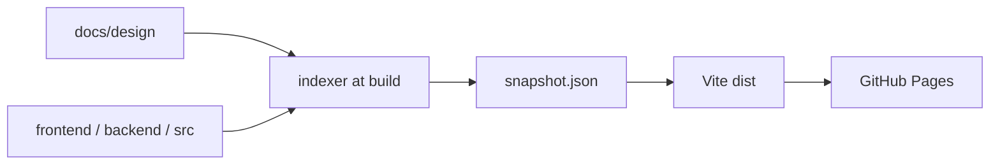

# アーキテクチャ

## 技術スタック

| 層 | 技術 |
|----|------|
| UI | React + TypeScript + Vite + `@xyflow/react` |
| 索引 | Node スクリプト（ビルド前） |
| 公開 | GitHub Pages（静的 `dist`） |
| 入力 | `docs/design/`、`frontend/` / `backend/` / `src/`（読み取り専用） |

## システム構成

## 配置

| パス | 役割 |
|------|------|
| `tools/spec-browser/` | ビューア本体 |
| `docs/design/` | 入力（ゲーム設計・本ツール設計） |
| `.github/workflows/spec-browser-pages.yml` | `develop` 合併後に Pages 公開 |
