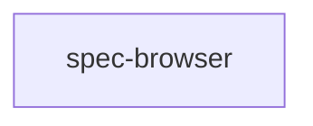

# 機能マップ

## 機能一覧

| 機能ID | 名前 | ステータス | 概要 |
|--------|------|------------|------|
| spec-browser | 設計把握キャンバス | draft | 設計とソースをノードキャンバスで表示し Pages 公開する |

## 機能間の関係

## 実装順序（案）

| 順序 | 機能ID | 理由 |
|------|--------|------|
| 1 | spec-browser | 単一機能。indexer → キャンバス → Pages の順 |
