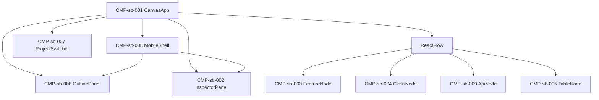

# UIコンポーネント: 設計把握キャンバス

## コンポーネントツリー

## コンポーネント一覧

| CMP-ID | 名前 | 役割 | 親 | 主な入出力 |
|--------|------|------|-----|------------|
| CMP-sb-001 | CanvasApp | ヘッダー・フィルタ状態・キャンバス統括 | — | snapshot 読込、`?project=` / `?node=` |
| CMP-sb-002 | InspectorPanel | 選択ノード詳細。関連はクリック遷移 | CMP-sb-001 / 008 | nodeId → 詳細、遷移先 nodeId |
| CMP-sb-003 | FeatureNode | 機能カード | Flow | feature データ |
| CMP-sb-004 | ClassNode | クラスカード（共通/固有色） | Flow | class データ |
| CMP-sb-005 | TableNode | テーブルカード | Flow | table データ |
| CMP-sb-006 | OutlinePanel | 機能チェック＋層/エンドポイント/TBL 折りたたみツリー | CMP-sb-001 / 008 | 機能マルチ選択、node 選択、開閉 |
| CMP-sb-007 | ProjectSwitcher | 設計プロジェクト1件選択 | CMP-sb-001 | projects[] → projectId |
| CMP-sb-008 | MobileShell | ≤768px でドロワー制御（一覧/詳細の排他） | CMP-sb-001 | open: none / outline / inspector |
| CMP-sb-009 | ApiNode | エンドポイントカード（API-） | Flow | api データ |
