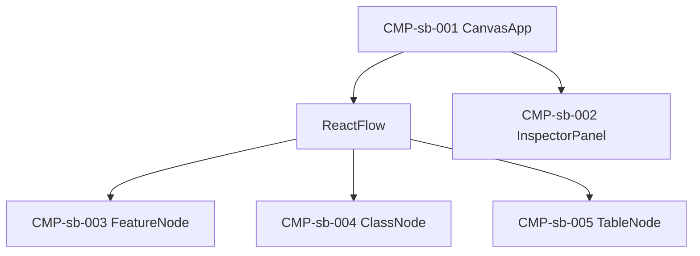

# UIコンポーネント: 設計把握キャンバス

> screens.md 確定後に記述する。

## コンポーネントツリー

## コンポーネント一覧

| CMP-ID | 名前 | 役割 | 親 | 主な入出力 |
|--------|------|------|-----|------------|
| CMP-sb-001 | CanvasApp | ヘッダー・キャンバス・インスペクタ | — | snapshot 読込 |
| CMP-sb-002 | InspectorPanel | 選択ノード詳細 | CMP-sb-001 | nodeId → 詳細 |
| CMP-sb-003 | FeatureNode | 機能カード | Flow | feature データ |
| CMP-sb-004 | ClassNode | クラスカード（共通/固有色） | Flow | class データ |
| CMP-sb-005 | TableNode | テーブルカード | Flow | table データ |
