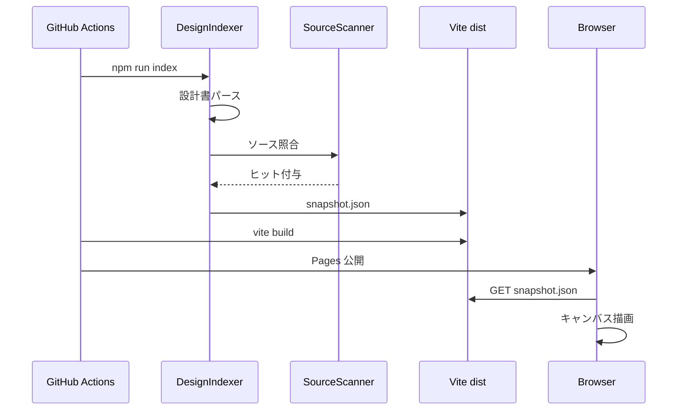

# フロー: 設計把握キャンバス

## シーケンス

```mermaid
sequenceDiagram
  participant CI as GitHub Actions
  participant Idx as DesignIndexer
  participant Scan as SourceScanner
  participant Dist as Vite dist
  participant User as Browser
  CI->>Idx: npm run index
  Idx->>Idx: 設計書パース
  Idx->>Scan: ソース照合
  Scan-->>Idx: ヒット付与
  Idx->>Dist: snapshot.json
  CI->>Dist: vite build
  CI->>User: Pages 公開
  User->>Dist: GET snapshot.json
  User->>User: キャンバス描画
```

## 状態遷移

| 状態 | イベント | 次の状態 |
|------|----------|----------|
| 未読込 | snapshot 取得成功 | 表示中 |
| 表示中 | ノード選択 | 選択中 |
| 選択中 | 別ノード選択 | 選択中 |
| 未読込 | 取得失敗 | エラー |
