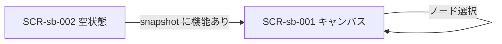

# 画面設計: 設計把握キャンバス

## ユースケースと画面の対応

| UC-ID | 必要な画面 |
|-------|------------|
| UC-sb-001 | SCR-sb-001 |
| UC-sb-002 | SCR-sb-001 |
| UC-sb-003 | SCR-sb-001 |
| UC-sb-004 | SCR-sb-001（Pages 上の同一画面） |
| （設計なし） | SCR-sb-002 |

## 画面一覧

| SCR-ID | 名前 | ルート | 主な操作 | 呼ぶAPI |
|--------|------|--------|----------|---------|
| SCR-sb-001 | キャンバス本体 | `/?node=` | パン・ズーム・ノード選択・層フィルタ | （静的 JSON） |
| SCR-sb-002 | 空状態キャンバス | `/` | なし（案内表示） | （静的 JSON） |

## 画面遷移



## 対応マトリクス

| SCR-ID | 画面 | 関連REQ | 呼ぶAPI | 主コンポーネント | 遷移先 |
|--------|------|---------|---------|------------------|--------|
| SCR-sb-001 | キャンバス本体 | REQ-sb-002,003,005 | — | CMP-sb-001,002,003 | 同一 |
| SCR-sb-002 | 空状態 | REQ-sb-002 | — | CMP-sb-001 | SCR-sb-001 |

---

## SCR-sb-001: キャンバス本体

### 目的

機能→クラス→DB の関係をノードグラフで把握し、詳細は右パネルで確認する。

### レイアウト

| エリア | 要素 | 動作 |
|--------|------|------|
| ヘッダー | タイトル、層フィルタ、ギャップ件数 | フィルタで列表示切替 |
| 中央 | React Flow キャンバス | パン・ズーム・選択 |
| 右 | インスペクタ | 選択に応じて内容更新 |
| 下中央 | ズーム / フィット / ロック | ビューポート操作 |

### ワイヤー（ASCII）

```
+------------------------------------------------------------------+
| Spec Browser          層フィルタ: 機能|クラス|DB    ギャップ N   |
+--------------------------------------------------+---------------+
|  [grid canvas]                                   | インスペクタ  |
|  (Feature)     (Class)         (Table)           | 選択ノード名  |
|  +--------+    +----------+    +--------+        | 詳細・ソース  |
|  | lobby  |--->| Session  |--->| session|        |               |
|  +--------+    +----------+    +--------+        |               |
|              [ -  100%  + ]  lock                |               |
+--------------------------------------------------+---------------+
```

### 状態

| 状態 | 見た目・振る舞い |
|------|------------------|
| 初期 | snapshot 読込、全ノード表示 |
| 選択中 | 関連辺ハイライト、右パネル更新 |
| フィルタ | 指定層以外を非表示（グラフデータは保持） |
| エラー | snapshot 読込失敗メッセージ |

### 操作と結果

| 操作 | 条件 | 結果 |
|------|------|------|
| ノードクリック | ノードあり | インスペクタ更新、`?node=` 更新 |
| ダブルクリック | ノードあり | 中心フィット、関連ハイライト |
| 層フィルタ | — | 列の表示切替 |

### ノード種別の色

| 種別 | 色の役割 | カード内容 |
|------|----------|------------|
| Feature | 緑系 | 機能ID、名前、REQ件数 |
| ClassCommon | ティール系 | CLS-、名前、層 |
| ClassFeature | 赤茶系 | CLS-、名前、所属機能 |
| Table | 別色 | TBL-、名前 |

---

## SCR-sb-002: 空状態キャンバス

### 目的

設計もソースも無いときに同じシェルで案内する。

### レイアウト

| エリア | 要素 | 動作 |
|--------|------|------|
| 中央 | プレースホルダ1ノード | 「まだ docs/design がありません」 |

### ワイヤー（ASCII）

```
+------------------------------------------------------------------+
| Spec Browser                          ギャップ 0  | ソース未検出 |
+--------------------------------------------------+---------------+
|  [ まだ docs/design がありません ]               | （空）       |
|  次: design-doc スキルで設計書を置く             |               |
+--------------------------------------------------+---------------+
```

### 状態

| 状態 | 見た目・振る舞い |
|------|------------------|
| 初期 | プレースホルダのみ |

### 操作と結果

| 操作 | 条件 | 結果 |
|------|------|------|
| — | — | 編集不可 |
