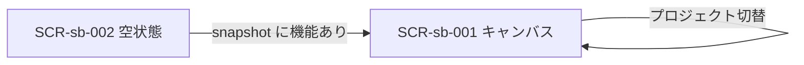

# 画面設計: 設計把握キャンバス

## ユースケースと画面の対応

| UC-ID | 必要な画面 |
|-------|------------|
| UC-sb-001 | SCR-sb-001 |
| UC-sb-002 | SCR-sb-001 |
| UC-sb-003 | SCR-sb-001 |
| UC-sb-004 | SCR-sb-001（Pages 上の同一画面） |
| UC-sb-005 | SCR-sb-001 |
| UC-sb-006 | SCR-sb-001 |
| UC-sb-007 | SCR-sb-001 |
| UC-sb-008 | SCR-sb-001 |
| UC-sb-009 | SCR-sb-001 |
| UC-sb-010 | SCR-sb-001 |
| UC-sb-011 | SCR-sb-001 |
| （設計なし） | SCR-sb-002 |

## 画面一覧

| SCR-ID | 名前 | ルート | 主な操作 | 呼ぶAPI |
|--------|------|--------|----------|---------|
| SCR-sb-001 | キャンバス本体 | `/?project=&node=` | プロジェクト切替・アウトライン・パン・ズーム・ノード選択・層/機能/検索フィルタ | （静的 JSON） |
| SCR-sb-002 | 空状態キャンバス | `/` | なし（案内表示） | （静的 JSON） |

## 画面遷移



## 対応マトリクス

| SCR-ID | 画面 | 関連REQ | 呼ぶAPI | 主コンポーネント | 遷移先 |
|--------|------|---------|---------|------------------|--------|
| SCR-sb-001 | キャンバス本体 | REQ-sb-002,003,005〜014 | — | CMP-sb-001〜009 | 同一 |
| SCR-sb-002 | 空状態 | REQ-sb-002,011 | — | CMP-sb-001,008 | SCR-sb-001 |

---

## SCR-sb-001: キャンバス本体

### 目的

機能→クラス→API→DB の関係をノードグラフとアウトラインで把握し、詳細はインスペクタで確認する。設計プロジェクトは常に1件だけ表示する。

### レイアウト（デスクトップ・幅 >768px）

| エリア | 要素 | 動作 |
|--------|------|------|
| ヘッダー | タイトル、プロジェクト切替、検索、ギャップのみ、層フィルタ、ギャップ件数 | 絞り込み・切替 |
| 左 | アウトライン（機能チェック＋層/エンドポイント/TBL 折りたたみ） | 機能マルチ選択・ノード選択・セクション開閉 |
| 中央 | React Flow キャンバス | パン・ズーム・選択 |
| 右 | インスペクタ | 選択に応じて内容更新。関連はクリック遷移 |
| 下中央 | ズーム / フィット / ロック | ビューポート操作 |
| 右下 | MiniMap（コンパクト） | 俯瞰・パン。モバイルでは非表示 |

### ワイヤー（ASCII・デスクトップ）

```
+------------------------------------------------------------------+
| Spec Browser  [project v]  検索…  ギャップのみ  層  ギャップ N   |
+--------+----------------------------------------+----------------+
| アウトライン|  Feature → Class(層) → Api → Table   | インスペクタ   |
| ▼ 機能    |  UI/API層クラス ──→ 同一 Api ノード | 概要・JSON    |
| □ lobby  |  （絞り込み後は上から再配置）           | 引数・戻り値  |
| ▼ Domain |  継承: Class -.-> Class（破線）       | 関連→ジャンプ |
| ▼ API    |                                      |          [MM]|
| ▼ エンドポイント|                                |               |
| ▼ テーブル|                                      |               |
+--------+----------------------------------------+----------------+
```

※ アウトラインの「API」はクラス層。「エンドポイント」は `API-…` 一覧。
### レイアウト（モバイル・幅 ≤768px）

| エリア | 要素 | 動作 |
|--------|------|------|
| ヘッダー | ≡、プロジェクト、検索トグル、ギャップ件数 | 折りたたみでフィルタ到達 |
| 主面 | キャンバス全幅 | パン・ズーム・タップ選択 |
| 下 | [一覧] [詳細] | アウトライン／インスペクタのドロワー開閉（同時不可） |

### ワイヤー（ASCII・モバイル）

```
+---------------------+
| ≡  [project v]  🔍  |
|    ギャップ N        |
+---------------------+
|                     |
|   キャンバス全幅     |
|                     |
|  [一覧]     [詳細]  |
+---------------------+
```

### 状態

| 状態 | 見た目・振る舞い |
|------|------------------|
| 初期 | snapshot 読込、先頭（または `?project=`）プロジェクト、機能チェック0＝全機能表示 |
| プロジェクト切替 | 他プロジェクトのノード非表示、アウトライン再構築、`?project=` 更新 |
| 選択中 | 関連辺ハイライト、インスペクタ更新、`?node=` 更新 |
| 機能フィルタ | チェック機能の部分グラフのみ（0件＝全機能） |
| 検索 / ギャップのみ | 一致しないノードを非表示（データは保持） |
| 層フィルタ | 指定層以外を非表示 |
| モバイル・ドロワー | 一覧または詳細のどちらか一方 |
| エラー | snapshot 読込失敗メッセージ（狭幅でも可読） |

### 操作と結果

| 操作 | 条件 | 結果 |
|------|------|------|
| プロジェクト切替 | projects あり | 表示スコープ切替、`?project=` 更新、再配置 |
| 機能フィルタ | チェック変更 | 部分グラフ＋コンパクト再配置＋fitView |
| ノードクリック / タップ | ノードあり | インスペクタ更新、`?node=` 更新 |
| ダブルクリック | デスクトップ・ノードあり | 中心フィット、関連ハイライト |
| 検索 / ギャップのみ | — | 一致しないノードを非表示→再配置 |
| 層フィルタ | — | 列の表示切替→再配置 |
| アウトライン折りたたみ | — | セクション開閉（データは保持） |
| 関連リンククリック | インスペクタ | 対象ノードへ遷移 |
| [一覧] / [詳細] | モバイル | 対応ドロワーを開く（他方は閉じる） |

### ノード種別の色

| 種別 | 色の役割 | カード内容 |
|------|----------|------------|
| Feature | 緑系 | 機能ID、名前、REQ件数 |
| ClassCommon | ティール系 | CLS-、名前、層 |
| ClassFeature | 赤茶系 | CLS-、名前、所属機能 |
| Api | 青紫系 | API-、概要（短）、メソッド |
| Table | 別色 | TBL-、名前 |

継承辺（`inherits`）は破線で Class → Class（継承元方向は設計表の「継承元」→当該クラス）。
`class→api` / `feature→api` は実線。
---

## SCR-sb-002: 空状態キャンバス

### 目的

設計もソースも無いときに同じシェルで案内する。

### レイアウト

| エリア | 要素 | 動作 |
|--------|------|------|
| 中央 | プレースホルダ1ノード | 「まだ docs/design がありません」 |

### ワイヤー（ASCII）

```
+------------------------------------------------------------------+
| Spec Browser                          ギャップ 0  | ソース未検出 |
+--------------------------------------------------+---------------+
|  [ まだ docs/design がありません ]               | （空）       |
|  次: design-doc スキルで設計書を置く             |               |
+--------------------------------------------------+---------------+
```

モバイルではプレースホルダと案内文が縦積みで読めること。

### 状態

| 状態 | 見た目・振る舞い |
|------|------------------|
| 初期 | プレースホルダのみ |

### 操作と結果

| 操作 | 条件 | 結果 |
|------|------|------|
| — | — | 編集不可 |
