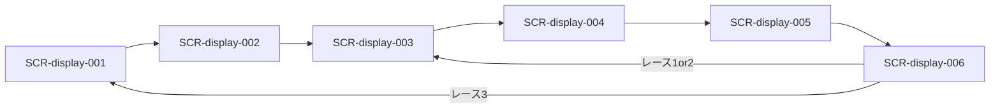

# 画面設計: ディスプレイ（横断）

見た目ラフ: [試合開始前設計.png](./試合開始前設計.png) / [ゲーム進行画面-ディスプレイ側.png](./ゲーム進行画面-ディスプレイ側.png)  
ルール・流れ: [`../../hotstreak/00-project/overview.md`](../../hotstreak/00-project/overview.md)

## このファイルの位置づけ

| 層 | パス | 役割 |
|----|------|------|
| 正本（機能・REQ・API） | `docs/design/hotstreak/features/<機能ID>/screens.md` | spec-browser・実装 Issue が参照 |
| 横断ビュー（本ファイル） | `docs/design/wireframes/display/DESIGN.md` | ディスプレイ側 SCR を一覧・遷移で見る |
| 旧草案 | [screens.md](./screens.md) | **廃止**（本ファイルへ統合済み） |

**矛盾時は機能別 `screens.md` を優先する。** 本ファイルは `tools/design/build_wireframe_design_md.py` で再生成できる。

## ユースケースと画面の対応

| UC-ID | 必要な画面 |
|-------|------------|
| UC-lobby-003 | SCR-display-001 |
| UC-lobby-004 | SCR-display-001 |
| UC-lobby-005 | SCR-phone-001, SCR-display-001 |
| UC-setup-002 | SCR-display-002 |
| UC-setup-004 | SCR-display-002 |
| UC-betting-004 | SCR-display-003 |
| UC-betting-005 | SCR-phone-002, SCR-display-003 |
| UC-betting-006 | SCR-display-003 |
| UC-seed-002 | SCR-display-004 |
| UC-seed-003 | SCR-display-004 |
| UC-seed-004 | SCR-display-004 |
| UC-race-001 | SCR-display-005 |
| UC-race-002 | SCR-display-005 |
| UC-race-003 | SCR-display-005 → payout 画面 |
| UC-payout-003 | SCR-display-006 |
| UC-payout-004 | SCR-display-006 |

## 画面一覧

| SCR-ID | 名前 | ルート | 主な操作 | 呼ぶAPI |
|--------|------|--------|----------|---------|
| SCR-display-001 | 参加受付 | （Display 全画面） | なし（QR 提示・Enter 連携） | API-LOBBY-001, 002, 005 |
| SCR-display-002 | 公開カード | （Display 全画面） | なし（Enter 連携） | API-SETUP-001, 002 |
| SCR-display-003 | マ券ドラフト共有 | （Display 全画面） | なし（Enter 連携） | API-BETTING-001, 004 |
| SCR-display-004 | 仕込み〜準備完了 | （Display 全画面） | なし（Enter 連携） | API-SEED-001, 003 |
| SCR-display-005 | レース進行 | （Display 全画面） | なし（自動演出） | API-RACE-001 |
| SCR-display-006 | 着順・結果 | （Display 全画面） | Enter 連携 | API-PAYOUT-001, 002 |


## 画面遷移（ディスプレイ）



## 実装ソース（Pygame）

| SCR-ID | パス | 状態 |
|--------|------|------|
| SCR-display-001 | `src/hotstreak_display/screens/lobby.py`（予定） | 未実装 |
| SCR-display-002 | [`src/hotstreak_display/screens/setup_cards.py`](../../../src/hotstreak_display/screens/setup_cards.py) | 一部実装 |
| SCR-display-003 | （未配置） | 未実装 |
| SCR-display-004 | （未配置） | 未実装 |
| SCR-display-005 | （未配置） | 未実装 |
| SCR-display-006 | （未配置） | 未実装 |

## 対応マトリクス

| SCR-ID | 画面 | 関連REQ | 呼ぶAPI | 主コンポーネント | 遷移先 |
|--------|------|---------|---------|------------------|--------|
| SCR-display-001 | 参加受付 | REQ-lobby-001, 003, 006, 007 | API-LOBBY-001, 002, 005 | CMP-lobby-001, 002, 003 | SCR-display-002 |
| SCR-display-002 | 公開カード | REQ-setup-002, 003, 005, 006 | API-SETUP-001, 002 | CMP-setup-001, 002, 003 | SCR-display-003 |
| SCR-display-003 | マ券共有 | REQ-betting-003, 006 | API-BETTING-001, 004 | CMP-betting-001〜004 | SCR-display-004 |
| SCR-display-004 | 仕込み〜準備 | REQ-seed-002, 003, 004 | API-SEED-001, 003 | CMP-seed-001〜003 | SCR-display-005 |
| SCR-display-005 | レース進行 | REQ-race-001〜004 | API-RACE-001 | CMP-race-001〜005 | SCR-display-006 |
| SCR-display-006 | 着順・結果 | REQ-payout-005, 006 | API-PAYOUT-001, 002 | CMP-payout-001〜003 | 003 または 001 |

---

## SCR-display-001: 参加受付

### 目的

QR を大きく示し、参加者数とアイコン／名前一覧を更新する。

### レイアウト

| エリア | 要素 | 動作 |
|--------|------|------|
| 左 | QR コード | 参加用 joinUrl |
| 右 | 人数 n/8、参加者リスト | 参加・名前確定のたびに同期更新 |

### ワイヤー（ASCII）

```
+------------------------------------------+
| 参加受付                                  |
| +--------+   参加者  6 / 8               |
| |  QR    |   [熊]くま  [魚]さかな ...     |
| |        |   ---- 空き枠 ----             |
| +--------+                                |
+------------------------------------------+
```

### 状態

| 状態 | 見た目・振る舞い |
|------|------------------|
| 受付中 | QR 有効・リスト増加 |
| 全員揃い | 進行可能（Enter または自動遷移の案内） |
| 締め | Enter 後は受付停止・SCR-display-002 へ |

### 操作と結果

| 操作 | 条件 | 結果 |
|------|------|------|
| （会場）ラズパイ Enter | 参加者 3 人以上 | API-LOBBY-005・setup-cards へ |
| 全員名前確定 | 参加者全員 | 同上（揃いでも可） |

---

## SCR-display-002: 公開カード

### 目的

スターター＋人数分のレースカードを表向きに見せ、マスコットごとの気配を共有する。

### レイアウト

| エリア | 要素 | 動作 |
|--------|------|------|
| 案内 | 「場のカード（公開）」、人数・枚数説明 | 表示のみ |
| グリッド／レーン | 公開カード（アイコン／効果）。レーン別に並べてもよい | setup.state で同期 |
| フッター | Enter でマ券へ、の案内 | Enter → advance |

### ワイヤー（ASCII）

```
+------------------------------------------+
| 場のカード（公開）                        |
| 人数に応じて枚数が変わる                  |
| [火][水][葉][雷][骨]                      |
| [羽][日][渦][山][目]  ...                 |
|                                           |
| ラズパイ Enter でマ券ドラフトへ           |
+------------------------------------------+
```

### 状態

| 状態 | 見た目・振る舞い |
|------|------------------|
| 配布中 | 短時間のプレースホルダ（任意）。完了まで Enter 無効でも可 |
| 公開中 | カード一覧表示・Enter 有効 |
| 締め | advance 後は SCR-display-003 へ |

### 操作と結果

| 操作 | 条件 | 結果 |
|------|------|------|
| （会場）ラズパイ Enter | 配布完了済み | API-SETUP-002・betting へ |

---

## SCR-display-003: マ券ドラフト共有

### 目的

サイドベットお題と、ドラフト中の残り札／手番を会場に見せる。

### レイアウト

| エリア | 要素 | 動作 |
|--------|------|------|
| お題 | 今レースのサイドベット文面 | 同期 |
| リスト | 残りマ券の概要 | 同期 |
| 手番 | 今誰の番か | 強調 |
| フッター | Enter 案内 | Enter → advance |

### ワイヤー（ASCII）

```
+------------------------------------------+
| マ券ドラフト中                            |
| サイドベット: 「（お題文面）」            |
| 手番: （プレイヤー名）                    |
| 残りマ券: （色ごと残枚）                  |
| ラズパイ Enter で仕込みへ可               |
+------------------------------------------+
```

### 操作と結果

| 操作 | 条件 | 結果 |
|------|------|------|
| （会場）ラズパイ Enter | 全員2枚＋第3は double 済み | API-BETTING-004・card-seed へ |

---

## SCR-display-004: 仕込み〜準備完了

### 目的

仕込み待ち、束の確定（公開＋仕込み）、まもなく開始を示す。

### レイアウト

| エリア | 要素 | 動作 |
|--------|------|------|
| 仕込み中 | 「スマホで1枚仕込んでください」 | 進捗 n/人数 |
| 束確定 | 裏向きカードの集合イメージ | 枚数（標準18） |
| 準備完了 | 「まもなく開始」 | 遷移直前 |

### ワイヤー（ASCII）

```
+------------------------------------------+
| カード仕込み中  3 / 4 人済                |
| レース用カード束  18 枚                   |
| [?][?][?][?][?] ...                       |
| ラズパイ Enter でレースへ可               |
+------------------------------------------+
```

---

## SCR-display-005: レース進行

### 目的

バーン、カードめくり、マスコット移動、コース短縮を演出する。レース中にプレイヤー判断は入れない。

### レイアウト

| エリア | 要素 | 動作 |
|--------|------|------|
| 上バー | START〜GOAL 進捗 | 位置同期 |
| 右上 | 今回のカード | めくりごと更新 |
| 中央 | コース・マスコット4体 | 移動・向き・転倒 |
| 演出 | 3,2,1 / GO / コース短縮 | フェーズ表示 |

### ワイヤー（ASCII）

```
+------------------------------------------+
| START =====o==o====o====o==== GOAL       |
|                      今回のカード         |
|                      [ 対象 +効果 ]       |
|   （コースグリッド／マスコット）          |
+------------------------------------------+
```

OPEN: マス表現は 4レーン×12（ワイヤー数え上げ）。効果ラベルは manual §6 の種別名。

---

## SCR-phone-004: レース観戦

### 目的

Display を追いながら自分のマ券・所持金・プレイヤー順位を常時表示する。

### レイアウト

| エリア | 要素 | 動作 |
|--------|------|------|
| 上部 | サイドベットお題 | 固定表示 |
| 中央 | マスコット簡易順位 | 同期 |
| 下部 | 自分のマ券・所持金・順位 | 同期 |
| アクション | 全員の状況 | 004b |

### 操作と結果

| 操作 | 条件 | 結果 |
|------|------|------|
| 全員の状況 | レース中 | SCR-phone-004b |
| （自動） | race.finished | SCR-phone-005 |

---

## SCR-phone-004b: 全員状況

### 目的

他プレイヤーの購入マ券（表裏）を一覧参照する。

### 操作と結果

| 操作 | 条件 | 結果 |
|------|------|------|
| 閉じる | 表示中 | SCR-phone-004 に戻る |

---

## SCR-display-006: 着順・結果

### 目的

表彰・着順を大きく見せる。個人払戻の詳細は Phone。

### レイアウト

| エリア | 要素 | 動作 |
|--------|------|------|
| タイトル | RACE n RESULT | 表示 |
| 順位 | 1〜4位マスコット | 表示 |
| フッター | Enter 案内 | Enter → advance |

### 操作と結果

| 操作 | 条件 | 結果 |
|------|------|------|
| Enter | 配当表示中 | 次 betting、または lobby（レース3） |

---
