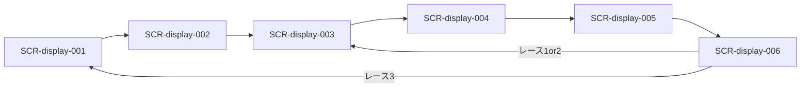

# 画面設計: ディスプレイ（ラフ→MD）

ラフ: [試合開始前設計.png](./試合開始前設計.png)、[ゲーム進行画面-ディスプレイ側.png](./ゲーム進行画面-ディスプレイ側.png)  
用語・遷移の正: [`../../hotstreak/00-project/overview.md`](../../hotstreak/00-project/overview.md)  
※ 機能詳細の `features/<id>/screens.md` へ後で移植する草案。UC / REQ / API は未採番。

## ユースケースと画面の対応

| UC-ID | 必要な画面 |
|-------|------------|
| （未採番）参加受付 | SCR-display-001 |
| （未採番）公開カード | SCR-display-002 |
| （未採番）マ券フェーズ共有 | SCR-display-003 |
| （未採番）仕込み・束確定 | SCR-display-004 |
| （未採番）レース演出 | SCR-display-005 |
| （未採番）着順・配当共有 | SCR-display-006 |

## 画面一覧

| SCR-ID | 名前 | ルート | 主な操作 | 呼ぶAPI |
|--------|------|--------|----------|---------|
| SCR-display-001 | 参加受付 | （未定） | なし（QR提示・人数表示） | （未定） |
| SCR-display-002 | 公開カード | （未定） | なし | （未定） |
| SCR-display-003 | マ券ドラフト共有 | （未定） | なし（お題・残り札の可視化） | （未定） |
| SCR-display-004 | 仕込み〜準備完了 | （未定） | なし | （未定） |
| SCR-display-005 | レース進行 | （未定） | Enterで1枚めくる（バーン・効果・短縮を演出） | （未定） |
| SCR-display-006 | 着順・結果 | （未定） | なし | （未定） |

## 画面遷移



公開カード（002）は試合セットアップ時が主。レース間は主に 003→004→005→006。

## 対応マトリクス

| SCR-ID | 画面 | 関連REQ | 呼ぶAPI | 主コンポーネント | 遷移先 |
|--------|------|---------|---------|------------------|--------|
| SCR-display-001 | 参加受付 | — | — | — | SCR-display-002 |
| SCR-display-002 | 公開カード | — | — | — | SCR-display-003 |
| SCR-display-003 | マ券共有 | — | — | — | SCR-display-004 |
| SCR-display-004 | 仕込み〜準備 | — | — | — | SCR-display-005 |
| SCR-display-005 | レース進行 | — | — | — | SCR-display-006 |
| SCR-display-006 | 着順 | — | — | — | 003 または 001 |

---

## SCR-display-001: 参加受付

### 目的

QRを大きく示し、参加者数とアイコン／名前一覧を更新する（開始前PNG①）。

### レイアウト

| エリア | 要素 | 動作 |
|--------|------|------|
| 左 | QRコード | 参加用 |
| 右 | 人数 n/上限、参加者リスト | 参加のたびに同期更新 |

### ワイヤー（ASCII）

```
+------------------------------------------+
| 参加受付                                  |
| +--------+   参加者  6 / 10               |
| |  QR    |   [熊]くま  [魚]さかな ...     |
| |        |   ---- 空き枠 ----             |
| +--------+                                |
+------------------------------------------+
```

### 状態

| 状態 | 見た目・振る舞い |
|------|------------------|
| 受付中 | QR有効・リスト増加 |
| 締め | Enter 後は受付停止（案） |

### 操作と結果

| 操作 | 条件 | 結果 |
|------|------|------|
| （会場）ラズパイ Enter | セットアップ完了／司会進行 | 公開カードまたはマ券フェーズへ |
| 全員名前確定 | 参加者全員 | 同上（揃いでも可） |

---

## SCR-display-002: 公開カード

### 目的

スターター＋人数分のレースカードを表向きに見せ、マスコットごとの気配を共有する（開始前PNG④・ルールの face-up cards）。

### レイアウト

| エリア | 要素 | 動作 |
|--------|------|------|
| 案内 | 人数に応じた枚数の説明 | 表示 |
| グリッド | 公開カード（アイコン／効果） | レーン別に並べてもよい |

### ワイヤー（ASCII）

```
+------------------------------------------+
| 場のカード（公開）                        |
| 人数に応じて枚数が変わる                  |
| [火][水][葉][雷][骨]                      |
| [羽][日][渦][山][目]  ...                 |
+------------------------------------------+
```

### 状態

| 状態 | 見た目・振る舞い |
|------|------------------|
| 公開中 | 全員が参照可能 |
| レース開始後 | 非表示またはデッキへ吸収済み |

### 操作と結果

| 操作 | 条件 | 結果 |
|------|------|------|
| （なし） | — | ベット開始で 003 へ |

---

## SCR-display-003: マ券ドラフト共有

### 目的

サイドベットお題と、ドラフト中の残り札／参加者の選択状況を会場に見せる（開始前PNG②の共有側）。

### レイアウト

| エリア | 要素 | 動作 |
|--------|------|------|
| お題 | 今レースのサイドベット文面 | レース間で更新 |
| リスト | 参加者、残りマ券の概要 | 同期 |
| 手番 | 今誰の番か | 強調 |

### ワイヤー（ASCII）

```
+------------------------------------------+
| マ券ドラフト中                            |
| サイドベット: 「気絶するマスコットは？」  |
| 手番: くま                                |
| 残りマ券: 赤x3 青x2 黄x4 ...              |
| 参加者一覧 ...                            |
+------------------------------------------+
```

### 状態

| 状態 | 見た目・振る舞い |
|------|------------------|
| ドラフト中 | 手番・在庫更新 |
| 完了 | 仕込みフェーズへ |

### 操作と結果

| 操作 | 条件 | 結果 |
|------|------|------|
| （なし） | スマホで操作 | 全員2枚取得後に 004 |

---

## SCR-display-004: 仕込み〜準備完了

### 目的

仕込み待ち、束の確定（公開＋仕込み）、まもなく開始を示す（開始前PNG③⑤⑥の Display 側）。

### レイアウト

| エリア | 要素 | 動作 |
|--------|------|------|
| 仕込み中 | 「スマホで1枚仕込んでください」 | 進捗 n/人数 |
| 束確定 | 裏向きカードの集合イメージ | 枚数表示（標準18） |
| 準備完了 | 「まもなく開始」 | 短時間 |

### ワイヤー（ASCII）

```
+------------------------------------------+
| カード仕込み中  3 / 4 人済                |
| （操作はスマホ）                          |
+------------------------------------------+
| レース用カード束  18 枚                   |
| [?][?][?][?][?] ...                       |
+------------------------------------------+
| 全員の準備が整いました。まもなく開始      |
+------------------------------------------+
```

### 状態

| 状態 | 見た目・振る舞い |
|------|------------------|
| 仕込み待ち | 進捗表示 |
| 束確定 | 枚数確定 |
| 準備完了 | レース画面へ |

### 操作と結果

| 操作 | 条件 | 結果 |
|------|------|------|
| （なし） | 全員仕込み完了 | SCR-display-005 |

---

## SCR-display-005: レース進行

### 目的

バーン、カードめくり、マスコット移動、衝突・転倒等、コース短縮を演出する（進行PNG①〜⑧）。レース中にプレイヤー判断は入れない。

### レイアウト

| エリア | 要素 | 動作 |
|--------|------|------|
| 上バー | START〜GOAL の簡易進捗 | 位置同期 |
| 右上 | 今回のカード（対象・効果） | めくりごとに更新 |
| 中央 | コース・マスコット4体 | 移動・向き・転倒 |
| 演出 | 3,2,1 / GO / コース短縮 | フェーズ表示 |

### ワイヤー（ASCII）

```
+------------------------------------------+
| START =====o==o====o====o==== GOAL       |
|                      今回のカード         |
|                      [ くま +2 ]          |
|                                           |
|  [コースグリッド／島背景]                 |
|   さかな くま とり うさぎ のスプライト    |
|                                           |
| （山切れ時）左からコース短縮＝折りたたみ  |
+------------------------------------------+
```

カウントダウン／GO:

```
+------------------------------------------+
|            3  →  2  →  1  →  GO!         |
|         （上3枚バーン）                   |
+------------------------------------------+
```

### 状態

| 状態 | 見た目・振る舞い |
|------|------------------|
| 待機 | スタートライン整列 |
| バーン／GO | カウント演出 |
| 進行 | Enterごとに1枚解決。長押し・解決中の追加入力は無視 |
| コース短縮 | マット折り相当の削除演出、下にいた駒は失格 |
| 3体終了 | 着順画面へ |

### 操作と結果

| 操作 | 条件 | 結果 |
|------|------|------|
| Enter | 1押下で1枚をめくり、効果解決後に次のEnterを待つ | 3体ゴールまたは失格で 006 |

### ラフとの差分

- PNG「コース崩壊」→ ルール上の **コース短縮（リシャッフル）** として実装・説明

---

## SCR-display-006: 着順・結果

### 目的

表彰・着順を大きく見せる（進行PNG⑨）。個人払戻の詳細はスマホ（SCR-phone-005）。

### レイアウト

| エリア | 要素 | 動作 |
|--------|------|------|
| タイトル | RACE n RESULT | 表示 |
| 順位 | 1〜4位マスコット | 表示 |
| 装飾 | マスコット／旗など | 任意 |

### ワイヤー（ASCII）

```
+------------------------------------------+
|           RACE 1 RESULT                   |
|  1. くま                                  |
|  2. さかな                                |
|  3. とり                                  |
|  4. うさぎ                                |
|                      (旗・演出)           |
+------------------------------------------+
```

### 状態

| 状態 | 見た目・振る舞い |
|------|------------------|
| 表示 | 一定時間 |
| レース間 | マスコットを表彰台に残してもよい（ベット参照用） |
| 次へ | レース1–2→003、レース3→001または終了演出 |

### 操作と結果

| 操作 | 条件 | 結果 |
|------|------|------|
| （なし） | 配当表示後 Enter | 次レースの 003、または試合終了 |
