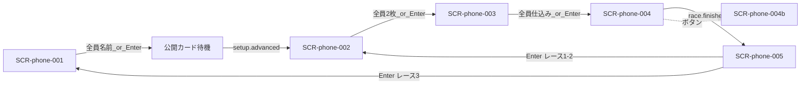

# 画面設計: スマホ（横断）

見た目ラフ: [hotstreak-wireframes.html](./hotstreak-wireframes.html) / [screen-01-title.html](./screen-01-title.html)  
ルール・流れ: [`../../hotstreak/00-project/overview.md`](../../hotstreak/00-project/overview.md)

## このファイルの位置づけ

| 層 | パス | 役割 |
|----|------|------|
| 正本（機能・REQ・API） | `docs/design/hotstreak/features/<機能ID>/screens.md` | spec-browser・実装 Issue が参照 |
| 横断ビュー（本ファイル） | `docs/design/wireframes/phone/DESIGN.md` | スマホ側 SCR を一覧・遷移で見る |
| 旧草案 | [screens.md](./screens.md) | **廃止**（本ファイルへ統合済み） |

**矛盾時は機能別 `screens.md` を優先する。** 本ファイルは `tools/design/build_wireframe_design_md.py` で再生成できる。

進行: **時間遷移なし**。次フェーズは **全員揃い** または **ラズパイ Enter**。

## ユースケースと画面の対応

| UC-ID | 必要な画面 |
|-------|------------|
| UC-lobby-001 | SCR-phone-001 |
| UC-lobby-002 | SCR-phone-001 |
| UC-lobby-005 | SCR-phone-001, SCR-display-001 |
| UC-setup-003 | （Phone 専用 SCR なし・待機） |
| UC-betting-001 | SCR-phone-002 |
| UC-betting-002 | SCR-phone-002 |
| UC-betting-003 | SCR-phone-002 |
| UC-betting-005 | SCR-phone-002, SCR-display-003 |
| UC-seed-001 | SCR-phone-003 |
| UC-race-004 | SCR-phone-004 |
| UC-race-005 | SCR-phone-004b |
| UC-payout-002 | SCR-phone-005 |

## 画面一覧

| SCR-ID | 名前 | ルート | 主な操作 | 呼ぶAPI |
|--------|------|--------|----------|---------|
| SCR-phone-001 | ロビー（参加） | `/join/{sessionId}` | 名前入力・確定 | API-LOBBY-003, 004 |
| SCR-phone-002 | マ券ドラフト | `/play/{sessionId}/betting` | 札選択・裏返し・確定・ダブル指定 | API-BETTING-001〜003 |
| SCR-phone-003 | カード仕込み | `/play/{sessionId}/seed` | 手札1枚選択・確定 | API-SEED-001, 002 |
| SCR-phone-004 | レース観戦 | `/play/{sessionId}/race` | 全員状況ボタン | API-RACE-001 |
| SCR-phone-004b | 全員状況 | （モーダル） | 閉じる | API-RACE-001 |
| SCR-phone-005 | 配当 | `/play/{sessionId}/payout` | なし（閲覧） | API-PAYOUT-001 |


## 画面遷移（スマホ）



## 実装ソース（Pygame / Web）

| SCR-ID | パス | 状態 |
|--------|------|------|
| SCR-phone-001 | （未配置） | 未実装 |
| （待機） | Phone シェル | setup-cards 中は専用 SCR なし |
| SCR-phone-002 | （未配置） | 未実装 |
| SCR-phone-003 | （未配置） | 未実装 |
| SCR-phone-004 / 004b | （未配置） | 未実装 |
| SCR-phone-005 | （未配置） | 未実装 |

## 対応マトリクス

| SCR-ID | 画面 | 関連REQ | 呼ぶAPI | 主コンポーネント | 遷移先 |
|--------|------|---------|---------|------------------|--------|
| SCR-phone-001 | ロビー（参加） | REQ-lobby-002, 003, 004 | API-LOBBY-003, 004 | CMP-lobby-010, 011, 012 | SCR-phone-002 |
| SCR-phone-002 | マ券ドラフト | REQ-betting-001〜005 | API-BETTING-001〜003 | CMP-betting-010〜014 | SCR-phone-003 |
| SCR-phone-003 | カード仕込み | REQ-seed-001, 003 | API-SEED-001, 002 | CMP-seed-010〜013 | SCR-phone-004 |
| SCR-phone-004 | レース観戦 | REQ-race-005 | API-RACE-001 | CMP-race-010〜013 | SCR-phone-005 |
| SCR-phone-004b | 全員状況 | REQ-race-006 | API-RACE-001 | CMP-race-014 | 閉じると 004 |
| SCR-phone-005 | 配当 | REQ-payout-001〜005 | API-PAYOUT-001 | CMP-payout-010〜013 | 002 または 001 |

---

## SCR-phone-001: ロビー（参加）

### 目的

QR 参加後に名前を確定し、参加者一覧を共有する。セットアップ完了は **全員の名前確定**、または **ラズパイ Enter**。

### レイアウト

| エリア | 要素 | 動作 |
|--------|------|------|
| ヘッダー | タイトル「ホットストリーク」、案内文 | 表示のみ |
| 入力 | プレイヤー名フィールド | テキスト入力 |
| サマリー | 参加者人数 | 全端末同期で更新 |
| リスト | 参加者行（自分／他者・入力済／入力中） | 名前確定で反映 |
| フッター | 「この名前で決定」、Enter／全員待ち案内 | 確定ボタンでリスト更新 |

### ワイヤー（ASCII）

```
+---------------------------+
| ホットストリーク          |
| QRを読み取って参加        |
|                           |
| プレイヤー名              |
| [ ヤマダ|               ] |
|                           |
|     参加者  4 人          |
| ヤマダ（自分）    入力済  |
| サトウ            入力済  |
| プレイヤー3       入力中  |
| プレイヤー4       入力中  |
|                           |
| [ この名前で決定 ]        |
| 全員入力後、または        |
| ラズパイ Enter で次へ     |
+---------------------------+
```

### 状態

| 状態 | 見た目・振る舞い |
|------|------------------|
| 未入力 | 確定不可または空名拒否 |
| 入力中 | カーソル表示 |
| 自分確定済 | 自分行が入力済、他端末に配信 |
| 待機 | 全員揃い待ち、または Enter 待ち |
| 受付終了 | lobby.advanced 受信後、次画面へ |

### 操作と結果

| 操作 | 条件 | 結果 |
|------|------|------|
| 名前確定 | 非空 | API-LOBBY-004 呼び出し・参加者リスト更新・配信 |
| 全員名前確定 | 参加者全員 nameReady | setup-cards へ（lobby.advanced） |
| ラズパイ Enter | 司会進行 | 同上（未確定はプレースホルダ名） |

---

## SCR-display-001: 参加受付

### 目的

QR を大きく示し、参加者数とアイコン／名前一覧を更新する。

### レイアウト

| エリア | 要素 | 動作 |
|--------|------|------|
| 左 | QR コード | 参加用 joinUrl |
| 右 | 人数 n/8、参加者リスト | 参加・名前確定のたびに同期更新 |

### ワイヤー（ASCII）

```
+------------------------------------------+
| 参加受付                                  |
| +--------+   参加者  6 / 8               |
| |  QR    |   [熊]くま  [魚]さかな ...     |
| |        |   ---- 空き枠 ----             |
| +--------+                                |
+------------------------------------------+
```

### 状態

| 状態 | 見た目・振る舞い |
|------|------------------|
| 受付中 | QR 有効・リスト増加 |
| 全員揃い | 進行可能（Enter または自動遷移の案内） |
| 締め | Enter 後は受付停止・SCR-display-002 へ |

### 操作と結果

| 操作 | 条件 | 結果 |
|------|------|------|
| （会場）ラズパイ Enter | 参加者 3 人以上 | API-LOBBY-005・setup-cards へ |
| 全員名前確定 | 参加者全員 | 同上（揃いでも可） |

---

## SCR-phone-002: マ券ドラフト

### 目的

スネークドラフトでマ券またはサイドベットを2枚取得し、各取得直後にセーフ／リスキーを選ぶ。第3レースでは2枚のうち1枚を配当ダブルに指定する。

### レイアウト

| エリア | 要素 | 動作 |
|--------|------|------|
| 手番バー | 「あなたの番」、周回・何人目 | 手番時のみ操作可 |
| メタ | レース n/3 | 表示 |
| リスト | 取得可能な札（配当・残り枚数・セーフ／リスキー） | タップで選択・裏返し |
| 所持 | 自分が取った札（最大2・空き枠） | 表示 |
| 第3追加 | ダブルにする札の指定 | 2枚目取得後 |
| フッター | この札に投票する | 手番で確定 |

### ワイヤー（ASCII）

```
+---------------------------+
| あなたの番です  2周目 3/4 |
| レース 1/3                |
|                           |
| > マ券A [セーフ]          |
|   タップで裏返す→リスキー |
|   残り 2枚                |
|   サイド YES/NO  (お題)   |
|                           |
| 所持中のマ券              |
| [マ券B リスキー] [ 空き ] |
|                           |
| [ この札に投票する ]      |
+---------------------------+
```

### 状態

| 状態 | 見た目・振る舞い |
|------|------------------|
| 他者の番 | 操作不可、手番待ち |
| 自分の番 | 選択・裏返し・確定可 |
| 在庫0 | 該当札を無効表示 |
| 第3・ダブル未指定 | 2枚目後に指定を促す |

### 操作と結果

| 操作 | 条件 | 結果 |
|------|------|------|
| 札を裏返す | 自分の番・選択中 | セーフ⇔リスキー |
| 投票確定 | 自分の番・在庫あり | API-BETTING-002・次手番 |
| ダブル指定 | 第3・所持2枚 | API-BETTING-003 |

金額表示は `features/payout/README.md` 観測確定表を参照（OPEN-betting-005／OPEN-payout-002）。

---

## SCR-display-003: マ券ドラフト共有

### 目的

サイドベットお題と、ドラフト中の残り札／手番を会場に見せる。

### レイアウト

| エリア | 要素 | 動作 |
|--------|------|------|
| お題 | 今レースのサイドベット文面 | 同期 |
| リスト | 残りマ券の概要 | 同期 |
| 手番 | 今誰の番か | 強調 |
| フッター | Enter 案内 | Enter → advance |

### ワイヤー（ASCII）

```
+------------------------------------------+
| マ券ドラフト中                            |
| サイドベット: 「（お題文面）」            |
| 手番: （プレイヤー名）                    |
| 残りマ券: （色ごと残枚）                  |
| ラズパイ Enter で仕込みへ可               |
+------------------------------------------+
```

### 操作と結果

| 操作 | 条件 | 結果 |
|------|------|------|
| （会場）ラズパイ Enter | 全員2枚＋第3は double 済み | API-BETTING-004・card-seed へ |

---

## SCR-phone-003: カード仕込み

### 目的

手札3枚から1枚をレーシングデッキへ仕込む。制限時間による強制遷移はしない。

### レイアウト

| エリア | 要素 | 動作 |
|--------|------|------|
| メタ | レース n/3、手札枚数、仕込み進捗 | 表示 |
| 手札 | 最大3枚（効果テキスト） | 1枚選択 |
| 状況 | 各プレイヤーの仕込み済／未 | 同期 |
| フッター | このカードを仕込む、Enter／全員待ち | 確定 |

### ワイヤー（ASCII）

```
+---------------------------+
| カードを1枚仕込む         |
| レース 2/3 ・ 手札3枚     |
| 仕込み 2 / 4 人           |
|                           |
| [カードA] [カードC] [E]   |
|                           |
| 仕込み状況                |
| ヤマダ（自分）  選択中    |
| サトウ          済        |
|                           |
| [ このカードを仕込む ]    |
| 全員済、または Enter で次 |
+---------------------------+
```

### 操作と結果

| 操作 | 条件 | 結果 |
|------|------|------|
| カード選択 | 未確定 | ハイライト |
| 仕込み確定 | 1枚選択済 | API-SEED-002 |
| 全員完了 | 全員済 | race へ |
| Enter | 司会 | 全員 seeded |

---

## SCR-display-004: 仕込み〜準備完了

### 目的

仕込み待ち、束の確定（公開＋仕込み）、まもなく開始を示す。

### レイアウト

| エリア | 要素 | 動作 |
|--------|------|------|
| 仕込み中 | 「スマホで1枚仕込んでください」 | 進捗 n/人数 |
| 束確定 | 裏向きカードの集合イメージ | 枚数（標準18） |
| 準備完了 | 「まもなく開始」 | 遷移直前 |

### ワイヤー（ASCII）

```
+------------------------------------------+
| カード仕込み中  3 / 4 人済                |
| レース用カード束  18 枚                   |
| [?][?][?][?][?] ...                       |
| ラズパイ Enter でレースへ可               |
+------------------------------------------+
```

---

## SCR-phone-004: レース観戦

### 目的

Display を追いながら自分のマ券・所持金・プレイヤー順位を常時表示する。

### レイアウト

| エリア | 要素 | 動作 |
|--------|------|------|
| 上部 | サイドベットお題 | 固定表示 |
| 中央 | マスコット簡易順位 | 同期 |
| 下部 | 自分のマ券・所持金・順位 | 同期 |
| アクション | 全員の状況 | 004b |

### 操作と結果

| 操作 | 条件 | 結果 |
|------|------|------|
| 全員の状況 | レース中 | SCR-phone-004b |
| （自動） | race.finished | SCR-phone-005 |

---

---

## SCR-phone-004b: 全員状況

### 目的

他プレイヤーの購入マ券（表裏）を一覧参照する。

### 操作と結果

| 操作 | 条件 | 結果 |
|------|------|------|
| 閉じる | 表示中 | SCR-phone-004 に戻る |

---

## SCR-phone-005: 配当

### 目的

着順と自分の払戻・全員の所持金順位を見せる。次へは Enter。

### レイアウト

| エリア | 要素 | 動作 |
|--------|------|------|
| タイトル | レース n 結果 | 表示 |
| 着順 | マスコット1〜4位 | 表示 |
| 自分 | 獲得金額・内訳（ダブル明示） | 表示 |
| 順位 | プレイヤー別所持金 | 自分強調 |
| フッター | Enter 案内 | 表示 |

### ワイヤー（ASCII）

```
+---------------------------+
| レース1 結果              |
| 着順  [1][2][3][4]        |
| あなたの獲得金額          |
| （内訳）                  |
| プレイヤー順位            |
| ラズパイ Enter で次へ     |
+---------------------------+
```

金額表示は README 観測確定表を参照。

---

## SCR-display-006: 着順・結果

### 目的

表彰・着順を大きく見せる。個人払戻の詳細は Phone。

### レイアウト

| エリア | 要素 | 動作 |
|--------|------|------|
| タイトル | RACE n RESULT | 表示 |
| 順位 | 1〜4位マスコット | 表示 |
| フッター | Enter 案内 | Enter → advance |

### 操作と結果

| 操作 | 条件 | 結果 |
|------|------|------|
| Enter | 配当表示中 | 次 betting、または lobby（レース3） |

---
