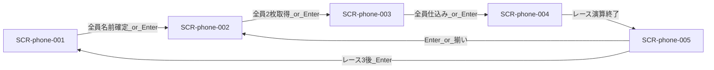

# 画面設計: スマホ（ラフ→MD）

ラフ: [hotstreak-wireframes.html](./hotstreak-wireframes.html)  
用語・遷移の正: [`../../hotstreak/00-project/overview.md`](../../hotstreak/00-project/overview.md)  
進行: **時間遷移なし**。次フェーズは **全員揃い** または **ラズパイ Enter**。  
※ 機能詳細の `features/<id>/screens.md` へ後で移植する草案。UC / REQ / API は未採番。

## ユースケースと画面の対応

| UC-ID | 必要な画面 |
|-------|------------|
| （未採番）参加 | SCR-phone-001 |
| （未採番）マ券ドラフト | SCR-phone-002 |
| （未採番）カード仕込み | SCR-phone-003 |
| （未採番）レース観戦 | SCR-phone-004（全員状況は 004b） |
| （未採番）配当確認 | SCR-phone-005 |

## 画面一覧

| SCR-ID | 名前 | ルート | 主な操作 | 呼ぶAPI |
|--------|------|--------|----------|---------|
| SCR-phone-001 | ロビー（参加） | （未定） | 名前入力・確定 | （未定） |
| SCR-phone-002 | マ券ドラフト | （未定） | 札選択・セーフ／リスキー・確定（第3は1枚ダブル） | （未定） |
| SCR-phone-003 | カード仕込み | （未定） | 手札1枚選択・確定 | （未定） |
| SCR-phone-004 | レース観戦 | （未定） | 全員状況ボタン（小画面を開く） | （未定） |
| SCR-phone-004b | 全員状況（小画面） | （モーダル） | 閉じる | （未定） |
| SCR-phone-005 | 配当 | （未定） | なし（次へは Enter／司会進行） | （未定） |

## 画面遷移

正規順（HTMLラフの「提出→馬券」は不採用）。時間経過では進まない。


## 対応マトリクス

| SCR-ID | 画面 | 関連REQ | 呼ぶAPI | 主コンポーネント | 遷移先 |
|--------|------|---------|---------|------------------|--------|
| SCR-phone-001 | ロビー | — | — | — | SCR-phone-002 |
| SCR-phone-002 | マ券ドラフト | — | — | — | SCR-phone-003 |
| SCR-phone-003 | カード仕込み | — | — | — | SCR-phone-004 |
| SCR-phone-004 | レース観戦 | — | — | — | SCR-phone-005（004b は重ね表示） |
| SCR-phone-004b | 全員状況 | — | — | — | 閉じると 004 |
| SCR-phone-005 | 配当 | — | — | — | SCR-phone-002 または 001 |

---

## SCR-phone-001: ロビー（参加）

### 目的

QR参加後に名前を確定し、参加者一覧を共有する。セットアップ完了は **全員の名前確定**、または **ラズパイ Enter**。

### レイアウト

| エリア | 要素 | 動作 |
|--------|------|------|
| ヘッダー | タイトル「ホットストリーク」、案内文 | 表示のみ |
| 入力 | プレイヤー名フィールド | テキスト入力 |
| サマリー | 参加者人数 | 全端末同期で更新 |
| リスト | 参加者行（自分／他者・入力済／入力中） | 名前確定で反映 |
| フッター | 「この名前で決定」、Enter／全員待ち案内 | 確定ボタンでリスト更新 |

### ワイヤー（ASCII）

```
+---------------------------+
| ホットストリーク          |
| QRを読み取って参加        |
|                           |
| プレイヤー名              |
| [ ヤマダ|               ] |
|                           |
|     参加者  4 人          |
| ヤマダ（自分）    入力済  |
| サトウ            入力済  |
| プレイヤー3       入力中  |
| プレイヤー4       入力中  |
|                           |
| [ この名前で決定 ]        |
| 全員入力後、または        |
| ラズパイ Enter で次へ     |
+---------------------------+
```

### 状態

| 状態 | 見た目・振る舞い |
|------|------------------|
| 未入力 | 確定不可または空名拒否 |
| 入力中 | カーソル表示 |
| 自分確定済 | 自分行が入力済、他端末に配信 |
| 待機 | 全員揃い待ち、または Enter 待ち |

### 操作と結果

| 操作 | 条件 | 結果 |
|------|------|------|
| 名前確定 | 非空 | 参加者リスト更新・配信 |
| 全員名前確定 | 参加者全員 | 次フェーズへ（公開カード／マ券） |
| ラズパイ Enter | 司会進行 | 次フェーズへ |
### ラフとの差分

- HTML「カード提出へ」→ 正規はマ券ドラフト前に公開カードあり。スマホはロビー後に SCR-phone-002

---

## SCR-phone-002: マ券ドラフト

### 目的

スネークドラフトでマ券またはサイドベットを2枚取得し、各取得直後にセーフ／リスキーを選ぶ。第3レースでは2枚のうち1枚を配当ダブルに指定する。

### レイアウト

| エリア | 要素 | 動作 |
|--------|------|------|
| 手番バー | 「あなたの番」、周回・何人目 | 手番時のみ操作可 |
| メタ | レース n/3 | 表示 |
| リスト | 取得可能な札（配当・残り枚数・セーフ／リスキー） | タップで選択・裏返し |
| 所持 | 自分が取った札（最大2・空き枠） | 表示 |
| 第3追加 | ダブルにする札の指定 | 2枚目取得後 |
| フッター | この札に投票する | 手番で確定 |

### ワイヤー（ASCII）

```
+---------------------------+
| あなたの番です  2周目 3/4 |
| レース 1/3                |
|                           |
| > マ券A [セーフ]   $300   |
|   タップで裏返す→リスキー |
|   残り 2枚                |
|   マ券B [リスキー] $900   |
|   ...                     |
|   サイド YES/NO  (お題)   |
|   残り0は選択不可         |
|                           |
| 所持中のマ券              |
| [マ券B リスキー] [ 空き ] |
|                           |
| [ この札に投票する ]      |
+---------------------------+
```

第3レース差分（全体×2はしない）:

```
+---------------------------+
| 最終レース・1枚をダブル   |
| 所持: [札A] [札B ★ダブル]|
| ★を付けた札のみ配当×2    |
+---------------------------+
```

### 状態

| 状態 | 見た目・振る舞い |
|------|------------------|
| 他者の番 | 操作不可、手番待ち |
| 自分の番 | 選択・裏返し・確定可 |
| 在庫0 | 該当札を無効表示 |
| 第3・ダブル未指定 | 2枚目後に指定を促す |

### 操作と結果

| 操作 | 条件 | 結果 |
|------|------|------|
| 札を裏返す | 自分の番・選択中 | セーフ⇔リスキー、表示配当更新 |
| 投票確定 | 自分の番・在庫あり | 在庫減・所持に追加・次手番 |
| ダブル指定 | 第3・所持2枚 | 選んだ1枚のみ×2 |

### ラフとの差分

- 「馬券／ノーマル」→ **マ券／セーフ**
- 「払戻すべて×2」→ **1枚ダブル**
- 遷移先はレースではなく **カード仕込み**

---

## SCR-phone-003: カード仕込み

### 目的

手札3枚から1枚をレーシングデッキへ仕込む。制限時間による強制遷移は**しない**。全員仕込み完了、またはラズパイ Enter で次へ。

### レイアウト

| エリア | 要素 | 動作 |
|--------|------|------|
| メタ | レース n/3、手札枚数、仕込み進捗 | 表示 |
| 手札 | 最大3枚（効果テキスト） | 1枚選択 |
| 状況 | 各プレイヤーの仕込み済／未 | 同期表示 |
| フッター | このカードを仕込む、Enter／全員待ち案内 | 確定 |

### ワイヤー（ASCII）

```
+---------------------------+
| カードを1枚仕込む         |
| レース 2/3 ・ 手札3枚     |
| 仕込み 2 / 4 人           |
|                           |
| [カードA] [カードC] [E*]  |
|  効果…    効果…   今回追加|
|                           |
| 仕込み状況                |
| ヤマダ（自分）  選択中    |
| サトウ          済        |
| プレイヤー3     未        |
|                           |
| [ このカードを仕込む ]    |
| 全員済、または Enter で次 |
+---------------------------+
```

### 状態

| 状態 | 見た目・振る舞い |
|------|------------------|
| 選択中 | 1枚ハイライト |
| 自分済・待ち | 確定後は変更不可（案）。他者待ち表示 |
| 全員済 | 次フェーズ可能（Enter でも可） |

### 操作と結果

| 操作 | 条件 | 結果 |
|------|------|------|
| カード選択 | 未確定 | ハイライト |
| 仕込み確定 | 1枚選択済 | 状況「済」、デッキへ裏追加 |
| 全員仕込み完了 | 全員済 | レース準備／観戦へ |
| ラズパイ Enter | 司会進行 | 次へ（未完了の確定は機能設計） |

### ラフとの差分

- 名称「提出」→ **仕込み**。遷移はマ券の**後**、レースの前
- **20秒タイマー・時間切れ抽選による遷移は廃止**

---

## SCR-phone-004: レース観戦

### 目的

Display のレースを追いながら、**自分のマ券・所持金・プレイヤー順位**を常時表示する。他プレイヤーの状況はボタンから小画面（SCR-phone-004b）で参照する。

### レイアウト

| エリア | 要素 | 動作 |
|--------|------|------|
| 上部 | サイドベットお題（YES/NO の内容） | 固定表示 |
| 中央 | マスコット簡易順位（1〜4） | 同期で並び替え |
| 下部（旧・全員マ券の位置） | **自分の購入マ券**、**所持金額**、**プレイヤー順位（自分強調）** | 同期更新 |
| アクション | 「全員の状況」ボタン | 押下で SCR-phone-004b を重ね表示 |
| フッター | レース終了で配当へ（演算。タイマーではない） | — |

### ワイヤー（ASCII）

```
+---------------------------+
| サイドベットお題          |
| （例）コースアウトある？  |
|                           |
| レース進行中              |
| [1位][2位][3位][4位]      |
|  くま  さかな とり うさぎ |
|                           |
| あなたのマ券              |
| [マ券B リスキー] [マ券E]  |
| 所持金  $1,400            |
| 順位    2位 / 4人         |
|                           |
| [ 全員の状況 ]            |
| 終了後に配当へ（Enter不要）|
| ※めくり終了はルール演算    |
+---------------------------+
```

### 状態

| 状態 | 見た目・振る舞い |
|------|------------------|
| 進行中 | マスコット順位・自分の所持金／順位を更新 |
| 小画面オープン | 004b をモーダル表示（背面は 004） |
| 終了直前 | Display の着順確定待ち |

### 操作と結果

| 操作 | 条件 | 結果 |
|------|------|------|
| 全員の状況 | レース中 | SCR-phone-004b を表示 |
| （自動） | レース演算で着順確定 | SCR-phone-005 |

### ラフとの差分

- 「今回のイベント」→ **サイドベットお題**
- 下部の「全員の馬券」一覧はやめ、**自分のマ券・金額・順位**に変更
- 全員分はボタン → 小画面へ移設

---

## SCR-phone-004b: 全員状況（小画面）

### 目的

レース中に他プレイヤーの購入マ券（表裏）を一覧参照する。004 の上に重ねるモーダル／ボトムシート。

### レイアウト

| エリア | 要素 | 動作 |
|--------|------|------|
| ヘッダー | 「全員の状況」、閉じる | 閉じで 004 に戻る |
| リスト | 各プレイヤー名と所持マ券（セーフ／リスキー込み） | 表示のみ |

### ワイヤー（ASCII）

```
+---------------------------+
| 全員の状況          [×]   |
|───────────────────────────|
| ヤマダ（自分）            |
|   マ券B リスキー ／ マ券E |
| サトウ                    |
|   マ券A ／ マ券C          |
| プレイヤー3               |
|   マ券D ／ マ券A リスキー |
| プレイヤー4               |
|   マ券E ／ マ券F          |
+---------------------------+
```

### 状態

| 状態 | 見た目・振る舞い |
|------|------------------|
| 表示中 | 背面のレース表示は維持（暗転可） |
| 閉じた後 | SCR-phone-004 のみ |

### 操作と結果

| 操作 | 条件 | 結果 |
|------|------|------|
| 閉じる（×／外側タップ） | 表示中 | SCR-phone-004 に戻る |

---

## SCR-phone-005: 配当

### 目的

着順と自分の払戻・全員の所持金順位を見せる。次レース／ロビーへは **ラズパイ Enter**（時間経過では進まない）。

### レイアウト

| エリア | 要素 | 動作 |
|--------|------|------|
| タイトル | レース n 結果 | 表示 |
| 着順 | マスコット1〜4位 | 表示 |
| 自分 | 獲得金額・内訳（マ券ごと） | 第3はダブル札を明示 |
| 順位 | プレイヤー別所持金 | 自分を強調 |
| フッター | Enter で次へ案内 | 表示 |

### ワイヤー（ASCII）

```
+---------------------------+
| レース1 結果              |
| 着順  [1][2][3][4]        |
|                           |
| あなたの獲得金額          |
| $1,400                    |
| マ券Bリスキー $900・E $500|
|                           |
| プレイヤー順位            |
| 1位 サトウ      $1,800    |
| 2位 ヤマダ(自分) $1,400   |
| ...                       |
| ラズパイ Enter で次へ     |
| （次マ券／3レース後ロビー）|
+---------------------------+
```

### 状態

| 状態 | 見た目・振る舞い |
|------|------------------|
| 表示中 | 操作なし（閲覧） |
| Enter 待ち | 次フェーズ待ち |

### 操作と結果

| 操作 | 条件 | 結果 |
|------|------|------|
| ラズパイ Enter | 配当表示中 | レース1–2→002、レース3→001 |

### ラフとの差分

- 「次はカード提出」「15秒後」→ **Enter で次はマ券ドラフト**（レース間リセット後）
- 全体×2ではなく、ダブル指定札のみ倍
- **時間経過による遷移は廃止**
