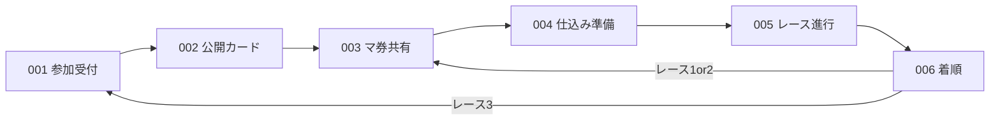

# ディスプレイ（会場画面）— 画面設計索引

ラズパイ上の **Pygame 全画面**クライアント。操作は司会の **Enter** とスマホ側の入力に委ね、会場共有の QR・公開情報・レース演出・着順を見せる。

## 正本の読み方

| 種類 | パス | 役割 |
|------|------|------|
| ルール・正規フロー | [`docs/design/hotstreak/00-project/overview.md`](../../docs/design/hotstreak/00-project/overview.md) | 原作寄せ。ワイヤーと食い違うときはこちら優先 |
| 画面ラフ（MD） | [`docs/design/wireframes/display/screens.md`](../../docs/design/wireframes/display/screens.md) | SCR-display-* のレイアウト・ASCII ワイヤー |
| 画面ラフ（PNG） | [`docs/design/wireframes/display/`](../../docs/design/wireframes/display/) | ビジュアル参考（順序は overview 準拠） |
| 機能別詳細 | [`docs/design/hotstreak/features/<機能ID>/screens.md`](../../docs/design/hotstreak/features/) | REQ / API / CMP 紐付け済み |
| アーキテクチャ | [`docs/design/hotstreak/00-project/architecture.md`](../../docs/design/hotstreak/00-project/architecture.md) | パッケージ配置・Sync 接続 |

本ファイルは **実装者向けの索引**。仕様の変更は `docs/design/` の設計 PR で行い、ここは追従で更新する。

## 共通規約

- 画面 ID: `SCR-display-<NNN>`（[`conventions.md`](../../docs/design/hotstreak/00-project/conventions.md)）
- フェーズ遷移に **タイマーは使わない**。次へは **全員揃い** または **ラズパイ Enter**（レース中のめくりはサーバ演算）
- 用語: **マ券**（馬券不可）、**セーフ／リスキー**、**コース短縮**（ワイヤー「コース崩壊」）
- 実装: `src/hotstreak_display/screens/<名前>.py` を 1 SCR 単位で追加。画面ランナー統合後は Enter と WS を共有

## 画面一覧と実装状況

| SCR-ID | 名前 | 機能 | 設計書 | ソース | 状態 |
|--------|------|------|--------|--------|------|
| SCR-display-001 | 参加受付 | lobby | [screens.md](../../docs/design/hotstreak/features/lobby/screens.md) | `screens/lobby.py`（未） | 未実装 |
| SCR-display-002 | 公開カード | setup-cards | [screens.md](../../docs/design/hotstreak/features/setup-cards/screens.md) | [`screens/setup_cards.py`](./screens/setup_cards.py) | **一部実装** |
| SCR-display-003 | マ券ドラフト共有 | betting | [screens.md](../../docs/design/hotstreak/features/betting/screens.md) | — | 未実装 |
| SCR-display-004 | 仕込み〜準備完了 | card-seed | [screens.md](../../docs/design/hotstreak/features/card-seed/screens.md) | — | 未実装 |
| SCR-display-005 | レース進行 | race | [screens.md](../../docs/design/hotstreak/features/race/screens.md) | — | 未実装 |
| SCR-display-006 | 着順・結果 | payout | [screens.md](../../docs/design/hotstreak/features/payout/screens.md) | — | 未実装 |

## 画面遷移（ディスプレイ単体）

セットアップ: `001 → 002`。各レース: `003 → 004 → 005 → 006`。

## スマホとの対応（会場で見せる／見せない）

| フェーズ | ディスプレイの役割 | スマホ（参考） |
|----------|-------------------|----------------|
| 参加・ロビー | QR・参加者一覧 | 名前入力 → [phone DESIGN](../hotstreak_phone/DESIGN.md) SCR-phone-001 |
| 公開カード | 表向きカード一覧 | 専用画面なし（待機） |
| マ券 | お題・手番・残札 | SCR-phone-002 で操作 |
| 仕込み | 進捗・束枚数・開始前 | SCR-phone-003 で操作 |
| レース | 演出のみ（プレイヤー操作なし） | SCR-phone-004 / 004b 観戦 |
| 配当 | 着順共有 | 個人払戻は SCR-phone-005 |

索引: [`docs/design/wireframes/README.md`](../../docs/design/wireframes/README.md)

## Sync 接続（概念）

Display は Sync へ HTTP + WebSocket。詳細は各機能の `api.md`。

| フェーズ | 主な購読 | Display の送信 |
|----------|----------|----------------|
| lobby | `lobby.state` 等 | Enter → advance（API-LOBBY-005） |
| setup-cards | `setup.state`, `setup.advanced` | Enter → advance（API-SETUP-002） |
| betting 以降 | 各 `*.state` / `*.advanced` | Enter 連携（機能ごとに設計書） |

### SCR-display-002 の実装メモ（現行コード）

- クラス: `DisplaySetupCardsScreen`（設計 CLS-setup-010）
- `setup.state` で `playerCount`, `dealt`, `faceUpCards` を表示。手札は受け取らない
- 公開枚数: 配布完了後 `18 - playerCount`（3〜8人）。サーバ値を表示しクライアントで抽選しない
- Enter: `POST .../advance`（楽観進行なし）。`phase=betting` で `on_advanced` コールバック
- ペイロード例・起動: [README.md](./README.md)

## 素材・実行

- 画像・フォント: [`assets/`](../../assets/)（Pygame 向け）
- 起動例: `python src/hotstreak_display/screens/setup_cards.py --demo --windowed`
- テスト: `tests/hotstreak_display/`

## Issue 分解の目安

ディスプレイ実装 Issue は機能ごとに **1 Issue = 1 SCR（または明確なまとまり）**。ラベル `ディスプレイ` / `機能/<id>`。分解表: [`task-breakdown.md`](../../docs/design/hotstreak/00-project/task-breakdown.md)
