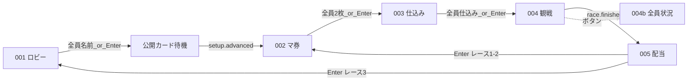

# スマホ（操作 UI）— 画面設計索引

各プレイヤーの **Web クライアント**（フレームワーク未確定。architecture 草案は Web + Sync）。参加・マ券・仕込み・観戦・配当の **個人操作と表示**を担う。会場共有はディスプレイ側。

## 正本の読み方

| 種類 | パス | 役割 |
|------|------|------|
| ルール・正規フロー | [`docs/design/hotstreak/00-project/overview.md`](../../docs/design/hotstreak/00-project/overview.md) | マ券→仕込み→レース→配当の順など |
| 画面ラフ（MD） | [`docs/design/wireframes/phone/screens.md`](../../docs/design/wireframes/phone/screens.md) | SCR-phone-* の詳細ワイヤー |
| 画面ラフ（HTML） | [`docs/design/wireframes/phone/`](../../docs/design/wireframes/phone/) | 見た目参考。**遷移順・タイマーは不採用**（README 注記） |
| 機能別詳細 | [`docs/design/hotstreak/features/<機能ID>/screens.md`](../../docs/design/hotstreak/features/) | ルート・API・CMP |
| ディスプレイ対応 | [`../hotstreak_display/DESIGN.md`](../hotstreak_display/DESIGN.md) | 二画面の役割分担 |

本ファイルは **実装着手前の索引**。`src/hotstreak_phone/` のアプリコードは未配置。仕様変更は `docs/design/` の設計 PR が正本。

## 共通規約

- 画面 ID: `SCR-phone-<NNN>`
- **時間経過で次画面へ進めない**（旧 HTML の 20秒／15秒は廃止）
- 用語: **マ券**、**セーフ／リスキー**、**仕込み**（旧「提出」）、第3レースは **1枚ダブル**（全体×2 不可）
- ルート案: 設計書どおり `/join/{sessionId}`、`/play/{sessionId}/<phase>`（機能 `screens.md` を参照）

## 画面一覧と実装状況

| SCR-ID | 名前 | 機能 | ルート（設計） | 設計書 | 状態 |
|--------|------|------|----------------|--------|------|
| SCR-phone-001 | ロビー（参加） | lobby | `/join/{sessionId}` | [lobby/screens.md](../../docs/design/hotstreak/features/lobby/screens.md) | 未実装 |
| — | 公開カード待機 | setup-cards | （シェル内待機） | [setup-cards/screens.md](../../docs/design/hotstreak/features/setup-cards/screens.md) | 専用 SCR なし |
| SCR-phone-002 | マ券ドラフト | betting | `/play/{sessionId}/betting` | [betting/screens.md](../../docs/design/hotstreak/features/betting/screens.md) | 未実装 |
| SCR-phone-003 | カード仕込み | card-seed | `/play/{sessionId}/seed` | [card-seed/screens.md](../../docs/design/hotstreak/features/card-seed/screens.md) | 未実装 |
| SCR-phone-004 | レース観戦 | race | `/play/{sessionId}/race` | [race/screens.md](../../docs/design/hotstreak/features/race/screens.md) | 未実装 |
| SCR-phone-004b | 全員状況 | race | （004 のモーダル） | [race/screens.md](../../docs/design/hotstreak/features/race/screens.md) | 未実装 |
| SCR-phone-005 | 配当 | payout | `/play/{sessionId}/payout` | [payout/screens.md](../../docs/design/hotstreak/features/payout/screens.md) | 未実装 |

## 画面遷移（スマホ）

正規順（HTML ラフの「提出→馬券」は **不採用**）。



## 画面ごとの要点（実装チェックリスト）

### SCR-phone-001 ロビー

- QR 参加後に名前入力・「この名前で決定」
- 参加者リスト同期（自分／他者・入力済／入力中）
- 次へ: 全員名前確定 or ラズパイ Enter → 公開カードフェーズ（待機）へ

ラフ: [wireframes phone SCR-phone-001 節](../../docs/design/wireframes/phone/screens.md#scr-phone-001-ロビー参加)

### 公開カード待機（SCR なし）

- `lobby.advanced` 後〜`setup.advanced` 前は操作画面を出さない（ローディング／待機文言で可）
- 公開カードの表示は **ディスプレイ SCR-display-002** のみ

### SCR-phone-002 マ券ドラフト

- スネークドラフト、手番時のみ操作
- 札の裏返しでセーフ⇔リスキー、在庫0は選択不可
- 第3レース: 所持2枚のうち **1枚だけ** 配当ダブル指定
- 次へ: 全員2枚取得 or Enter → 仕込み

### SCR-phone-003 カード仕込み

- 手札3枚から1枚選択してデッキへ仕込み
- 他プレイヤーの仕込み済／未を表示
- **タイマー強制遷移なし**

### SCR-phone-004 / 004b レース観戦

- 常時: サイドベットお題、簡易順位、**自分のマ券・所持金・順位**
- 「全員の状況」→ 004b モーダルで他者マ券一覧
- レース終了はサーバ `race.finished` で 005 へ（タイマーではない）

### SCR-phone-005 配当

- 着順・自分の獲得内訳・所持金順位
- 次へは **Enter**（レース1–2 → 002、レース3 → 001）

## Sync 接続（概念）

Phone は Sync に REST + WebSocket。操作は各機能の `API-*`（例: lobby `API-LOBBY-003/004`、betting `API-BETTING-001` など）。Enter によるフェーズ進行は主に **ディスプレイ** が送るが、**全員揃い**判定はサーバ側。

| フェーズ | スマホの主な操作 | 主な API（設計書参照） |
|----------|------------------|------------------------|
| lobby | 名前確定 | API-LOBBY-003, 004 |
| setup-cards | （待機のみ） | — |
| betting | 札取得・裏返し・ダブル | API-BETTING-001〜003 |
| card-seed | 仕込み確定 | API-SEED-001, 002 |
| race | 閲覧・004b | API-RACE-001 |
| payout | 閲覧 | API-PAYOUT-001 |

## HTML ラフとの対応

| HTML ラベル | SCR | 注意 |
|-------------|-----|------|
| 1. タイトル | 001 | — |
| 3. 馬券選択 | 002 | 表記はマ券 |
| 2. カード提出 | 003 | 正規フローでは **002 の後** |
| 4. レース中 | 004 | 下部 UI は設計 MD に合わせて変更済み |
| 4b. 全員状況 | 004b | — |
| 5. 結果発表 | 005 | 時間遷移なし |

## 想定ディレクトリ（未作成）

architecture 草案に従い、実装時は例えば次のように置く（確定は各機能 `layers.md`）。

```
src/hotstreak_phone/   # または frontend/ 等
  routes/              # sessionId 単位の画面
  components/          # CMP-* に対応
```

## Issue 分解の目安

スマホ実装は **ディスプレイ Issue と混ぜない**。ラベル `スマホ` / `機能/<id>`。分解表: [`task-breakdown.md`](../../docs/design/hotstreak/00-project/task-breakdown.md)
